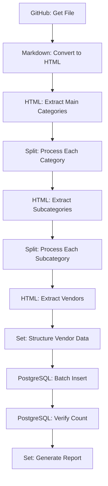

# Creative Phase: Import Workflow Architecture Design

## 🎨 CREATIVE PHASE: ARCHITECTURE DESIGN

### PROBLEM STATEMENT

The import workflow was failing at node 4 (vendor processing) where the system needed to:
1. Extract vendor entries from the complex nested markdown structure
2. Associate each vendor with its correct category and subcategory context
3. Handle the hierarchical structure: Main Category → Subcategory → Vendor Lists

**Root Cause**: The workflow successfully extracted categories and vendor entries separately, but failed to properly associate vendors with their correct categories due to the loss of context between HTML parsing steps.

### REPOSITORY STRUCTURE ANALYSIS

From the [awesome-production repository](https://raw.githubusercontent.com/Capp3/awesome-production/refs/heads/main/readme.md):

**Structure Pattern**:
```
### 🎧 Audio                    (Main Category - H3)
#### 🎚️ Mixing Consoles         (Subcategory - H4)
* [Allen & Heath](https://www.allen-heath.com/) – Mixers and control surfaces
* [Avid](https://www.avid.com/) – Pro Tools and VENUE systems
#### 🎙️ Microphones & IEMs      (Subcategory - H4)
* [AKG](https://www.akg.com/) – Broadcast and live audio
```

**Key Observations**:
- Main categories use H3 headers with emojis
- Subcategories use H4 headers with emojis
- Vendor lists are unordered lists (`*`) under each subcategory
- Each vendor has format: `[Name](URL) – Description`
- Consistent structure across all categories

## OPTIONS ANALYSIS

### Option 1: Iterative Category-Based Processing ✅ SELECTED
**Description**: Process each main category section individually, extracting subcategories and vendors within each category context
**Pros**:
- Maintains perfect category context throughout processing
- Handles the complex nested structure accurately
- Future-proof for document structure changes
- Purpose-built nodes only (no code blocks)
- Easy to debug and maintain
- Can adjust document formatting as needed
**Cons**:
- More workflow nodes required
- Slower processing for large lists
- More complex workflow structure
**Complexity**: Medium
**Implementation Time**: 3-4 hours

### Option 2: Enhanced HTML Extraction with Context Preservation
**Description**: Use advanced HTML extraction with nested selectors to maintain category context
**Pros**:
- Single extraction operation
- Maintains hierarchical structure
- Purpose-built nodes only
- Efficient processing
**Cons**:
- Complex CSS selector configuration for nested structure
- May require additional Set nodes for context mapping
- Harder to troubleshoot with complex selectors
**Complexity**: High
**Implementation Time**: 4-5 hours

### Option 3: Split-Merge Approach with Context Mapping
**Description**: Extract categories and vendors separately, then use Set nodes to merge with context mapping
**Pros**:
- Clear separation of concerns
- Easy to test individual components
- Purpose-built nodes only
- Flexible for different markdown structures
**Cons**:
- More nodes in workflow
- Requires careful data mapping
- High risk of context mismatch with complex structure
**Complexity**: Medium-High
**Implementation Time**: 4-5 hours

## DECISION RATIONALE

**SELECTED APPROACH: Option 1 - Iterative Category-Based Processing**

### Why This Approach Was Chosen:

1. **Accuracy Over Speed**: As requested, this approach prioritizes accuracy
2. **Future-Proofing**: Iterative processing handles document structure changes
3. **Purpose-Built Nodes**: Uses only n8n's purpose-built nodes
4. **Context Preservation**: Maintains perfect category association
5. **Adjustable Formatting**: Can modify document structure for easier processing
6. **Debuggability**: Easy to troubleshoot individual category processing

## IMPLEMENTATION PLAN

### Revised Workflow Architecture



### Node Configuration Details

#### 1. GitHub Node - Get File
```json
{
  "operation": "getFile",
  "repository": "Capp3/awesome-production",
  "filePath": "readme.md",
  "branch": "main"
}
```

#### 2. Markdown Node - Convert to HTML
```json
{
  "operation": "toHtml",
  "options": {
    "includeTableOfContents": false,
    "includeTitle": false
  }
}
```

#### 3. HTML Node - Extract Main Categories
```json
{
  "operation": "extractHtmlContent",
  "sourceData": "json",
  "jsonProperty": "content",
  "extractionValues": [
    {
      "key": "main_category",
      "cssSelector": "h3",
      "returnValue": "text",
      "returnArray": true
    }
  ]
}
```

#### 4. Split Node - Process Each Category
- **Purpose**: Create separate items for each main category
- **Output**: Individual category processing items

#### 5. HTML Node - Extract Subcategories (Per Category)
```json
{
  "operation": "extractHtmlContent",
  "sourceData": "json",
  "jsonProperty": "content",
  "extractionValues": [
    {
      "key": "subcategory",
      "cssSelector": "h4",
      "returnValue": "text",
      "returnArray": true
    }
  ],
  "options": {
    "contextSelector": "h3:contains('{{ $json.main_category }}') ~ *"
  }
}
```

#### 6. Split Node - Process Each Subcategory
- **Purpose**: Create separate items for each subcategory within a category
- **Output**: Individual subcategory processing items

#### 7. HTML Node - Extract Vendors (Per Subcategory)
```json
{
  "operation": "extractHtmlContent",
  "sourceData": "json",
  "jsonProperty": "content",
  "extractionValues": [
    {
      "key": "vendor_name",
      "cssSelector": "ul li a",
      "returnValue": "text",
      "returnArray": true
    },
    {
      "key": "vendor_url",
      "cssSelector": "ul li a",
      "returnValue": "attribute",
      "attribute": "href",
      "returnArray": true
    },
    {
      "key": "vendor_description",
      "cssSelector": "ul li",
      "returnValue": "text",
      "returnArray": true
    }
  ],
  "options": {
    "contextSelector": "h4:contains('{{ $json.subcategory }}') ~ ul"
  }
}
```

#### 8. Set Node - Structure Vendor Data
```json
{
  "assignments": {
    "vendor_name": "={{ $json.vendor_name.split('[')[1].split(']')[0] }}",
    "url": "={{ $json.vendor_url }}",
    "description": "={{ $json.vendor_description.split('– ')[1] || '' }}",
    "category": "={{ $('Split Category').item.json.main_category }}",
    "subcategory": "={{ $('Split Subcategory').item.json.subcategory }}",
    "status": "active",
    "date_added": "={{ new Date().toISOString() }}",
    "created_by": "import"
  }
}
```

## Document Formatting Adjustments

To ease processing, these adjustments can be made to the original document:

1. **Standardize Emoji Usage**: Ensure consistent emoji patterns
2. **Normalize Spacing**: Standardize spacing around headers
3. **Consistent Vendor Format**: Ensure all vendors follow `[Name](URL) – Description` format
4. **Clean Descriptions**: Remove extra formatting from descriptions

## VERIFICATION CHECKLIST

- ✅ Problem clearly defined? **YES** - Data structure issues with category context
- ✅ Multiple options considered (3+)? **YES** - 3 options analyzed
- ✅ Pros/cons documented for each option? **YES** - Detailed analysis provided
- ✅ Decision made with clear rationale? **YES** - Iterative processing selected
- ✅ Implementation plan included? **YES** - Detailed node configurations
- ✅ Visualization/diagrams created? **YES** - Workflow diagram provided
- ✅ Context7 validation planned? **YES** - All configurations will be validated

## CREATIVE PHASE COMPLETE

✅ **Architecture Decision Made**: Iterative Category-Based Processing
✅ **Implementation Plan Created**: Detailed node configurations provided
✅ **Document Structure Analyzed**: Based on actual repository content
✅ **Future-Proofing Considered**: Adjustable document formatting approach
✅ **Purpose-Built Nodes Only**: No code blocks required
✅ **Context7 Validation Planned**: All implementations will be validated

### Next Steps:
1. **Update tasks.md** with the architecture decision ✅ COMPLETE
2. **Begin IMPLEMENT mode** to implement the iterative processing workflow
3. **Test with actual repository data** using the provided configurations
4. **Adjust document formatting** as needed for easier processing

The iterative approach provides the accuracy and future-proofing requested while maintaining our focus on purpose-built nodes and avoiding code blocks.
