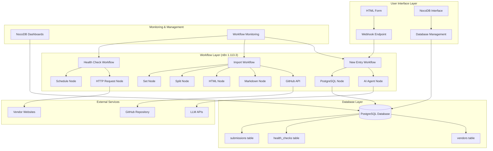
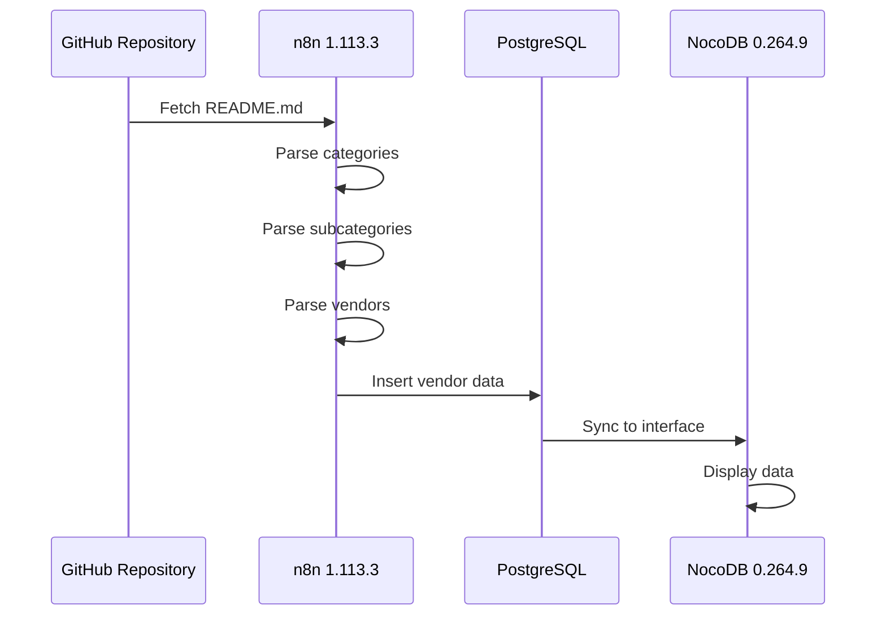
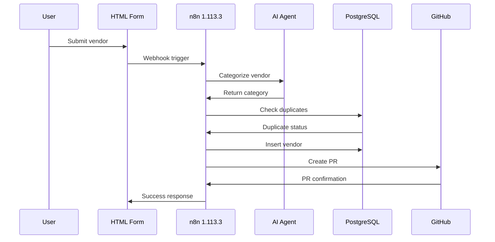
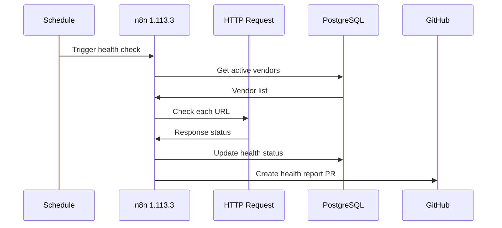
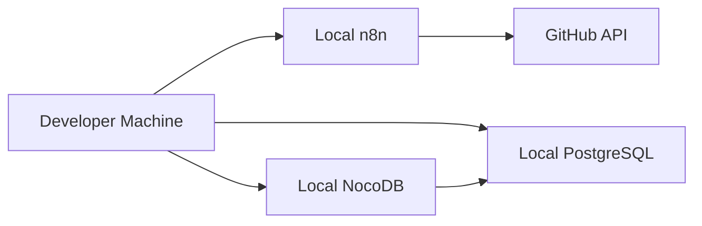
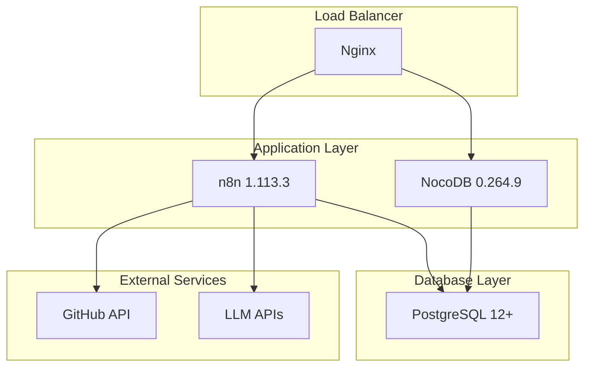

# System Architecture - Awesome Production Data Management System

## 🎯 Architecture Overview

This document provides a comprehensive view of the system architecture, ensuring compatibility with n8n 1.113.3 and NocoDB 0.264.9.

## 🏗️ System Components

### Core Platform Stack

- **n8n 1.113.3**: Workflow automation platform
- **NocoDB 0.264.9**: Database interface and management
- **PostgreSQL 12+**: Primary database backend
- **Node.js 18+**: Runtime environment

### External Integrations

- **GitHub API**: Repository management and PR creation
- **AI Agent Node**: LLM categorization and processing
- **HTTP APIs**: URL health monitoring
- **Context7**: Code review and validation

## 🔄 System Architecture Diagram



## 🔧 Component Details

### n8n 1.113.3 Workflows

#### 1. Import Workflow

- **Purpose**: One-time data migration from GitHub repository
- **Nodes**: GitHub → Markdown → HTML → Split → HTML → Split → HTML → Set → PostgreSQL
- **Features**: Iterative category-based processing
- **Compatibility**: n8n 1.113.3 optimized

#### 2. New Entry Workflow

- **Purpose**: Process form submissions and create PRs
- **Nodes**: Webhook → AI Agent → PostgreSQL → GitHub
- **Features**: Automated categorization and duplicate detection
- **Compatibility**: n8n 1.113.3 optimized

#### 3. Health Check Workflow

- **Purpose**: Monitor vendor URL health
- **Nodes**: Schedule → HTTP Request → PostgreSQL → GitHub
- **Features**: Automated URL monitoring and reporting
- **Compatibility**: n8n 1.113.3 optimized

### NocoDB 0.264.9 Features

#### Database Interface

- **Table Management**: Full CRUD operations
- **Data Visualization**: Charts and graphs
- **User Management**: Role-based access control
- **API Access**: RESTful API endpoints

#### New Features (v0.264.9)

- **Dashboards**: Visual data monitoring
- **Private Base**: Enhanced security
- **Bulk Update Extension**: Efficient multi-record operations
- **Page Designer**: Custom form layouts
- **Script Steps**: Advanced automation

### PostgreSQL Database Schema

#### Core Tables

```sql
-- Vendors table (primary data)
CREATE TABLE vendors (
    id SERIAL PRIMARY KEY,
    vendor_name VARCHAR(255) NOT NULL,
    url TEXT NOT NULL,
    description TEXT,
    category VARCHAR(100) NOT NULL,
    subcategory VARCHAR(100) NOT NULL,
    status VARCHAR(20) NOT NULL DEFAULT 'active',
    last_status_change TIMESTAMP WITH TIME ZONE,
    date_added TIMESTAMP WITH TIME ZONE NOT NULL DEFAULT NOW(),
    last_checked TIMESTAMP WITH TIME ZONE,
    created_by VARCHAR(20) NOT NULL,
    health_notes TEXT,
    created_at TIMESTAMP WITH TIME ZONE DEFAULT NOW(),
    updated_at TIMESTAMP WITH TIME ZONE DEFAULT NOW()
);

-- Health checks table (monitoring data)
CREATE TABLE health_checks (
    id SERIAL PRIMARY KEY,
    vendor_id INTEGER REFERENCES vendors(id),
    check_date TIMESTAMP WITH TIME ZONE DEFAULT NOW(),
    status_code INTEGER,
    response_time INTEGER,
    is_healthy BOOLEAN,
    error_message TEXT
);

-- Submissions table (form tracking)
CREATE TABLE submissions (
    id SERIAL PRIMARY KEY,
    vendor_name VARCHAR(255) NOT NULL,
    url TEXT NOT NULL,
    description TEXT,
    submitted_at TIMESTAMP WITH TIME ZONE DEFAULT NOW(),
    status VARCHAR(20) DEFAULT 'pending',
    processed_at TIMESTAMP WITH TIME ZONE,
    pr_url TEXT
);
```

## 🔄 Data Flow Architecture

### 1. Import Process Flow



### 2. New Entry Process Flow



### 3. Health Check Process Flow



## 🛡️ Security Architecture

### Authentication & Authorization

- **n8n**: Basic auth with encrypted credentials
- **NocoDB**: JWT-based authentication
- **PostgreSQL**: Role-based database access
- **GitHub**: Personal access tokens

### Data Security

- **Encryption**: At-rest and in-transit
- **Access Control**: Role-based permissions
- **Audit Logging**: All operations logged
- **Backup Strategy**: Automated daily backups

## 📊 Performance Architecture

### Scalability Considerations

- **Horizontal Scaling**: Multiple n8n instances
- **Database Optimization**: Proper indexing and query optimization
- **Caching**: Redis for frequently accessed data
- **Load Balancing**: Nginx for web traffic

### Monitoring & Alerting

- **n8n Monitoring**: Built-in workflow monitoring
- **NocoDB Dashboards**: Real-time data visualization
- **Database Monitoring**: Query performance tracking
- **System Monitoring**: Resource usage alerts

## 🔧 Deployment Architecture

### Development Environment



### Production Environment



## 🚀 Future Architecture Considerations

### Planned Enhancements

- **Microservices**: Split workflows into independent services
- **Event-Driven**: Implement event streaming for real-time updates
- **API Gateway**: Centralized API management
- **Container Orchestration**: Kubernetes deployment

### Scalability Roadmap

- **Phase 1**: Current monolithic architecture
- **Phase 2**: Service-oriented architecture
- **Phase 3**: Microservices architecture
- **Phase 4**: Cloud-native architecture

## 📋 Architecture Compliance

### n8n 1.113.3 Compliance

- ✅ Purpose-built nodes only
- ✅ AI Agent node for LLM operations
- ✅ Minimal code block usage
- ✅ Context7 validation ready

### NocoDB 0.264.9 Compliance

- ✅ Dashboard integration
- ✅ Private base security
- ✅ Bulk operations support
- ✅ Custom form capabilities

### PostgreSQL 12+ Compliance

- ✅ Modern SQL features
- ✅ Performance optimization
- ✅ Security best practices
- ✅ Backup and recovery

This architecture ensures optimal performance, security, and maintainability while leveraging the latest features of n8n 1.113.3 and NocoDB 0.264.9.
