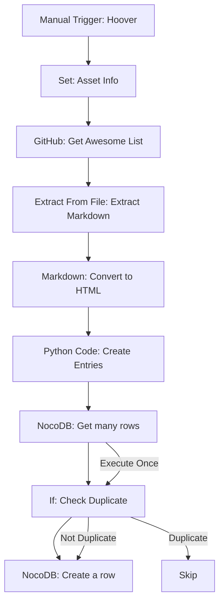

# One-Time Import Workflow

This workflow populates NocoDB with existing data from the current Awesome Production list. It's designed to be run once during initial setup to migrate all existing entries into NocoDB using native n8n integrations.

## Purpose

- Fetch the existing README.md from the GitHub repository using native GitHub node
- Extract vendor information (name, URL, description, category, subcategory) using Python Code node
- Check for duplicate entries before inserting
- Populate NocoDB with all existing entries using native NocoDB node
- Skip duplicates automatically

## Workflow Diagram



## Detailed Node Flow

### Step 1: Workflow Trigger

- **Manual Trigger Node (Hoover)**: Start the import process
- **Output**: Execution trigger

### Step 2: Configuration Setup

- **Set Node (Asset Info)**: Configure workflow parameters
  - GitHub user: `Capp3`
  - GitHub repo: `awesome-production`
  - NocoDB project and table IDs
- **Output**: Configuration data

### Step 3: Data Retrieval

- **GitHub Node (Get Awesome List)**: Fetch README.md from repository
- **Output**: Raw markdown content

### Step 4: Markdown Extraction

- **Extract From File Node (Extract Markdown)**: Extract markdown content from GitHub response
- **Output**: Markdown text content

### Step 5: Markdown Conversion

- **Markdown Node (Convert to HTML)**: Convert markdown to HTML
- **Output**: HTML content ready for parsing

### Step 6: Data Parsing & Extraction

- **Python Code Node (Create Entries)**: Parse HTML and extract all vendor data
- **Functions**:
  - Parse HTML structure to identify categories and subcategories
  - Extract vendor information (name, URL, description) for each category
  - Filter out table of contents entries
  - Structure data for NocoDB insertion
- **Output**: Array of structured vendor records

### Step 7: Duplicate Check

- **NocoDB Node (Get many rows)**: Fetch all existing records (execute once)
- **If Node**: Check if URL already exists in database
- **Output**: Duplicate status for each vendor

### Step 8: Database Insert

- **NocoDB Node (Create a row)**: Insert new vendor records
- **Only executes if**: URL doesn't exist (not duplicate)
- **Output**: Created record confirmation

## Detailed Steps

### 1. Manual Trigger

- **Node**: Manual Trigger
- **Name**: Hoover
- **Purpose**: Start the import workflow
- **Output**: Execution trigger

### 2. Configuration Setup

- **Node**: Set
- **Name**: Asset Info
- **Purpose**: Configure workflow parameters
- **Fields**:
  - `github_user`: `Capp3`
  - `github_repo`: `awesome-production`
- **Output**: Configuration data for downstream nodes

### 3. Fetch Current README

- **Node**: GitHub
- **Name**: Get Awesome List
- **Operation**: Get File
- **Repository**: `={{ $json.github_user }}/{{ $json.github_repo }}`
- **File Path**: `readme.md`
- **Output**: Raw markdown content

### 4. Extract Markdown Content

- **Node**: Extract From File
- **Name**: Extract Markdown
- **Operation**: Text
- **Purpose**: Extract markdown content from GitHub response
- **Output**: Markdown text content

### 5. Convert Markdown to HTML

- **Node**: Markdown
- **Name**: Convert to HTML
- **Purpose**: Convert markdown content to HTML for parsing
- **Input**: Markdown text from Extract From File node
- **Output**: HTML content ready for extraction

### 6. Parse and Extract All Data

- **Node**: Python Code
- **Name**: Create Entries
- **Purpose**: Parse HTML and extract all vendor data
- **Input**: HTML content from Markdown node
- **Output**: Array of structured vendor records

### 7. Check for Duplicates

- **Node**: NocoDB
- **Name**: Get many rows
- **Operation**: GetAll
- **Purpose**: Fetch all existing vendor records
- **Execute Once**: Yes (fetch once, check against all entries)
- **Output**: All existing vendor records

### 8. Duplicate Detection

- **Node**: If
- **Name**: If
- **Condition**: Check if URL exists in existing records
- **Logic**: `{{ $json.url }}` equals `{{ $('Get many rows').item.json.url }}`
- **Output**: True (duplicate) or False (new entry)

### 9. Insert New Records

- **Node**: NocoDB
- **Name**: Create a row
- **Operation**: Create
- **Purpose**: Insert new vendor records (skip duplicates)
- **Only executes**: When If condition is False (not duplicate)
- **Output**: Created record confirmation

## n8n Node Configuration

### Manual Trigger Node - Hoover

```json
{
  "parameters": {}
}
```

### GitHub Node - Get Awesome List

```json
{
  "resource": "file",
  "operation": "get",
  "owner": "Capp3",
  "repository": "awesome-production",
  "filePath": "readme.md",
  "additionalParameters": {
    "reference": "update"
  }
}
```

### Extract From File Node - Extract Markdown

```json
{
  "operation": "text",
  "options": {}
}
```

### Markdown Node - Convert to HTML

```json
{
  "mode": "markdownToHtml",
  "markdown": "={{ $json.data }}",
  "destinationKey": "content",
  "options": {}
}
```

### Python Code Node - Parse and Extract All Data

**Node Settings:**

- **Language**: Python
- **Mode**: Run Once for All Items

**Python Code:**

```python
import re
from bs4 import BeautifulSoup
from datetime import datetime

# Get HTML content from previous node using n8n's _input helper
input_items = _input.all()
html_content = input_items[0]['json']['content']

# Parse HTML
soup = BeautifulSoup(html_content, 'html.parser')

vendors = []
current_main_category = None
current_subcategory = None

# Process each element in the HTML
for element in soup.find_all(['h3', 'h4', 'li']):
    if element.name == 'h3':
        # Main category
        current_main_category = element.get_text().strip()
        current_subcategory = None

    elif element.name == 'h4':
        # Subcategory
        current_subcategory = element.get_text().strip()

    elif element.name == 'li' and element.find('a'):
        # Vendor entry
        link = element.find('a')
        vendor_name = link.get_text().strip()
        vendor_url = link.get('href', '')

        # Skip table of contents entries (markdown anchors start with #)
        if vendor_url.startswith('#'):
            continue

        # Skip entries without valid URLs (must contain http:// or https://)
        if not vendor_url or not (vendor_url.startswith('http://') or vendor_url.startswith('https://')):
            continue

        # Extract description (text after the link)
        description = element.get_text().strip()
        if '–' in description:
            description = description.split('–', 1)[1].strip()
        else:
            description = ''

        # Clean up vendor name (remove brackets if present)
        if '[' in vendor_name and ']' in vendor_name:
            vendor_name = vendor_name.split('[')[1].split(']')[0].strip()

        # Clean category name (remove emojis and extra characters)
        clean_category = current_main_category or 'Uncategorized'
        if clean_category:
            # Remove emojis and clean up the category name
            clean_category = re.sub(r'[^\w\s-]', '', clean_category).strip()
            if not clean_category:
                clean_category = 'Uncategorized'

        # Clean subcategory name
        clean_subcategory = current_subcategory or 'General'
        if clean_subcategory:
            clean_subcategory = re.sub(r'[^\w\s-]', '', clean_subcategory).strip()
            if not clean_subcategory:
                clean_subcategory = 'General'

        # Create vendor record
        vendor = {
            'vendor_name': vendor_name,
            'url': vendor_url,
            'description': description,
            'category': clean_category,
            'subcategory': clean_subcategory,
            'status': 'active',
            'date_added': datetime.now().isoformat(),
            'created_by': 'import'
        }

        vendors.append(vendor)

# Return all vendors as separate items for n8n
# Each item must be a dictionary with a 'json' key
return [{'json': vendor} for vendor in vendors]
```

**Key Points:**

- **Input Access**: Use `_input.all()` to access all input items (n8n standard)
- **Return Format**: Must return a list of dictionaries, each with a `'json'` key
- **No `def main()`**: Python Code node executes the script directly, no function wrapper needed
- **BeautifulSoup**: Automatically available in n8n Python Code nodes
- **URL Filtering**: Skips table of contents entries (# anchor links) and only processes valid HTTP/HTTPS URLs

### NocoDB Node - Get Existing Records

```json
{
  "authentication": "nocoDbApiToken",
  "operation": "getAll",
  "projectId": "pxtd3z9ygd9zprn",
  "table": "md5mzz6b4mvjs1p",
  "returnAll": true,
  "options": {}
}
```

**Configuration:**

- **Authentication**: NocoDB API Token
- **Execute Once**: Enabled (fetches all records once for duplicate checking)
- **Purpose**: Get all existing vendor records to check for duplicates

### If Node - Duplicate Detection

```json
{
  "conditions": {
    "options": {
      "caseSensitive": false,
      "typeValidation": "strict",
      "version": 2
    },
    "conditions": [
      {
        "leftValue": "={{ $json.url }}",
        "rightValue": "={{ $('Get many rows').item.json.url }}",
        "operator": {
          "type": "string",
          "operation": "equals"
        }
      }
    ],
    "combinator": "and"
  },
  "options": {
    "ignoreCase": true
  }
}
```

**Configuration:**

- **Condition**: Check if current URL matches any existing URL
- **Logic**: Compare `{{ $json.url }}` against all URLs from "Get many rows" node
- **Output**: True if duplicate found, False if new entry

### NocoDB Node - Create New Record

```json
{
  "authentication": "nocoDbApiToken",
  "operation": "create",
  "projectId": "pxtd3z9ygd9zprn",
  "table": "md5mzz6b4mvjs1p",
  "fieldsUi": {
    "fieldValues": [
      {
        "fieldName": "vendor_name",
        "fieldValue": "={{ $json.vendor_name }}"
      },
      {
        "fieldName": "url",
        "fieldValue": "={{ $json.url }}"
      },
      {
        "fieldName": "description",
        "fieldValue": "={{ $json.description }}"
      },
      {
        "fieldName": "category",
        "fieldValue": "={{ $json.category }}"
      },
      {
        "fieldName": "subcategory",
        "fieldValue": "={{ $json.subcategory }}"
      },
      {
        "fieldName": "status",
        "fieldValue": "={{ $json.status }}"
      },
      {
        "fieldName": "date_added",
        "fieldValue": "={{ $json.date_added }}"
      },
      {
        "fieldName": "creation_by",
        "fieldValue": "={{ $json.created_by }}"
      }
    ]
  }
}
```

**Configuration:**

- **Authentication**: NocoDB API Token
- **Project ID**: `pxtd3z9ygd9zprn`
- **Table ID**: `md5mzz6b4mvjs1p`
- **Field Mapping**: Maps Python output fields to NocoDB table columns
- **Only executes**: When If condition is False (not a duplicate)

**Important NocoDB Field Configuration:**

- **Field Names**: Must exactly match NocoDB table column names (case-sensitive)
- **Field Types**: Configure in NocoDB table schema as needed
- **URL Field**: Should be configured as URL or Text field
- **Date Fields**: Configure as Date/DateTime in NocoDB

**Troubleshooting NocoDB Issues:**

1. **Field Name Matching**: Ensure field names in NocoDB exactly match the field names in the node configuration
2. **Authentication**: Verify NocoDB API token has write permissions
3. **Project/Table IDs**: Confirm project and table IDs are correct
4. **Duplicate Checking**: "Get many rows" must have "Execute Once" enabled

## Category Mapping System

### Extracted Categories

The workflow automatically extracts these categories from the existing README:

**Main Categories:**

- Audio
- Video
- Lighting & Rigging
- Networking & Control
- Infrastructure & Hardware
- Power & Distribution
- Software

**Subcategories (examples):**

- Mixing Consoles
- Microphones & IEMs
- Cameras & Lenses
- LED Fixtures
- Network Switches
- Rack Equipment
- Power Distribution
- DAWs & Plugins

### Category Assignment Logic

- **Node**: Switch
- **Purpose**: Route entries based on extracted category context
- **Rules**:
  - Match vendor entries to their parent category/subcategory
  - Use context from HTML structure to maintain hierarchy
  - Fallback to "Uncategorized" for unmatched entries

### Switch Node Configuration

```json
{
  "rules": [
    {
      "condition": "{{ $json.category === 'Audio' }}",
      "output": "audio_processing"
    },
    {
      "condition": "{{ $json.category === 'Video' }}",
      "output": "video_processing"
    },
    {
      "condition": "{{ $json.category === 'Lighting & Rigging' }}",
      "output": "lighting_processing"
    },
    {
      "condition": "{{ $json.category === 'Networking & Control' }}",
      "output": "networking_processing"
    },
    {
      "condition": "{{ $json.category === 'Infrastructure & Hardware' }}",
      "output": "infrastructure_processing"
    },
    {
      "condition": "{{ $json.category === 'Power & Distribution' }}",
      "output": "power_processing"
    },
    {
      "condition": "{{ $json.category === 'Software' }}",
      "output": "software_processing"
    },
    {
      "condition": "{{ true }}",
      "output": "uncategorized_processing"
    }
  ]
}
```

## Error Handling

### Common Issues

1. **GitHub API Rate Limits**: Implement retry with exponential backoff
2. **HTML Parsing Errors**: Use fallback selectors for malformed content
3. **NocoDB Connection Issues**: Retry with exponential backoff
4. **Duplicate Entries**: Use conflict resolution (ignore duplicates)
5. **Category Mapping Failures**: Log for manual review

### Error Recovery

- **Retry Logic**: Built into n8n's native nodes
- **Fallback Parsing**: Alternative selectors for edge cases
- **Manual Review Queue**: Failed entries logged for human review
- **Import Report**: Detailed summary of successes and failures

## Testing

### Pre-Import Testing

1. Test GitHub node connection and file access
2. Verify HTML Extract selectors with sample data
3. Test NocoDB connection and table structure
4. Validate category extraction accuracy

### Post-Import Validation

1. Compare entry counts (imported vs. original)
2. Spot-check categorization accuracy against source
3. Verify all URLs are accessible
4. Test NocoDB queries and record relationships

## Monitoring

### Success Metrics

- Total entries imported
- Category extraction accuracy
- Processing time
- Error count and types

### Alerts

- GitHub API rate limit warnings
- NocoDB connection failures
- HTML parsing errors
- Import completion notifications

## Rollback Plan

If the import fails or produces incorrect data:

1. Delete imported records from NocoDB: Filter by `creation_by = 'import'` and delete
2. Restore from backup (if available)
3. Fix identified issues in workflow
4. Re-run the import workflow
5. Verify data integrity

## Dependencies

- n8n instance (version 1.115.3+)
- NocoDB project and table configured
- GitHub repository access (read permissions)
- Network connectivity for external APIs
- Python 3.8+ (included with n8n)
- BeautifulSoup4 library (automatically available in n8n Python Code nodes)
- Python Code (Beta) node support in n8n

## Estimated Runtime

- **Small list (< 100 entries)**: 30 seconds - 1 minute
- **Medium list (100-500 entries)**: 1-3 minutes
- **Large list (500+ entries)**: 3-5 minutes

_Times are significantly faster with Python node processing and direct HTML parsing._

## Workflow Benefits

### Python Code Node Advantages

- **Single Node Solution**: All parsing logic contained in one Python Code node
- **Better Performance**: Direct HTML parsing without multiple node transitions
- **Easier Maintenance**: Clear, readable Python code that's easy to modify
- **Flexible Parsing**: Can handle complex HTML structures and edge cases
- **No External Dependencies**: Uses built-in Python libraries (BeautifulSoup)
- **Simplified Architecture**: 5 nodes total vs 12+ with purpose-built approach
- **n8n 1.115.3 Compatible**: Uses the new Python Code (Beta) node

## Implementation Notes

### Prerequisites Setup

1. **GitHub Credentials**: Configure GitHub node with repository access
2. **NocoDB Connection**: Set up NocoDB API token credentials in n8n
3. **NocoDB Table**: Ensure Vendors table exists with proper field structure
4. **n8n Version**: Confirm version 1.115.3+ for Python node support
5. **Python Dependencies**: BeautifulSoup4 library (automatically installed in n8n Python nodes)

### Workflow Execution

1. **Manual Trigger**: Start workflow manually for initial import
2. **Monitor Progress**: Watch execution logs for any issues
3. **Verify Results**: Check NocoDB for imported entries
4. **Review Categories**: Ensure proper categorization

### Troubleshooting

- **GitHub API Issues**: Check rate limits and authentication
- **Python Code Node Errors**: Review HTML structure and adjust parsing logic
- **NocoDB Errors**: Confirm table structure and API permissions
- **NocoDB Field Name Errors**: Ensure field names match exactly (case-sensitive)
- **Category Mapping**: Check Python logic for category assignment
- **BeautifulSoup Issues**: Verify HTML structure matches expected format
- **Return Format Issues**: Ensure Python function returns `[{'json': vendor} for vendor in vendors]`
- **n8n Python Code Node**: Verify n8n version 1.115.3+ for Python Code (Beta) support

### Next Steps

After successful import:

1. Set up the New Entry Workflow for form submissions
2. Configure the Health Check Workflow for URL monitoring
3. Test the complete system with sample data
4. Document any customizations or modifications
