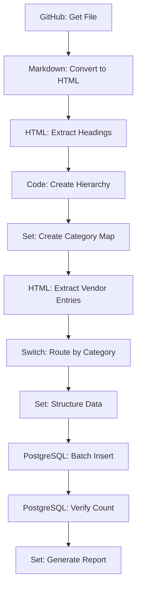

# One-Time Import Workflow

This workflow populates the database with existing data from the current Awesome Production list. It's designed to be run once during initial setup to migrate all existing entries into the database using native n8n integrations.

## Purpose

- Fetch the existing README.md from the GitHub repository using native GitHub node
- Extract vendor information (name, URL, description, category, subcategory) using native parsing nodes
- Use existing categories as reference for categorization (no LLM needed)
- Populate the database with all existing entries using native PostgreSQL node
- Verify the import was successful

## Workflow Diagram



## Detailed Node Flow

### Step 1: Data Retrieval
- **GitHub Node**: Fetch README.md from repository
- **Output**: Raw markdown content

### Step 2: Markdown Conversion
- **Markdown Node**: Convert markdown to HTML
- **Output**: HTML content ready for parsing

### Step 3: Category Extraction
- **HTML Node**: Extract main categories (h2) and subcategories (h4) separately
- **Code Node**: Build hierarchical structure by parsing HTML order
- **Set Node**: Create category mapping object
- **Output**: Structured category/subcategory mapping with parent-child relationships

### Step 4: Vendor Processing
- **HTML Node**: Extract vendor list items using extractHtmlContent operation
- **Switch Node**: Route entries based on category context
- **Set Node**: Structure data for database insertion
- **Output**: Formatted vendor records

### Step 5: Database Operations
- **PostgreSQL Node**: Batch insert vendor records
- **PostgreSQL Node**: Verify import count
- **Set Node**: Generate import summary report
- **Output**: Import statistics and status

## Detailed Steps

### 1. Fetch Current README
- **Node**: GitHub
- **Operation**: Get File
- **Repository**: `Capp3/awesome-production`
- **File Path**: `readme.md`
- **Branch**: `main`
- **Output**: Raw markdown content

### 2. Convert Markdown to HTML
- **Node**: Markdown
- **Purpose**: Convert markdown content to HTML for parsing
- **Input**: Raw markdown from GitHub
- **Output**: HTML content ready for extraction

### 3. Parse Markdown Structure
- **Node**: HTML
- **Operation**: Extract HTML Content
- **Purpose**: Extract main categories (h3) and subcategories (h4) separately
- **Source Data**: JSON (from Markdown node)
- **JSON Property**: `content`
- **Extraction Values**:
  - Key: `main_categories`
  - CSS Selector: `h3`
  - Return Value: `text`
  - Return Array: `true`
  - Key: `sub_categories`
  - CSS Selector: `h4`
  - Return Value: `text`
  - Return Array: `true`
- **Output**: Separate arrays for main categories and subcategories

### 4. Create Category Hierarchy
- **Node**: Code
- **Purpose**: Build hierarchical category structure
- **Logic**: Match subcategories to their parent main categories based on HTML structure
- **Output**: Structured category mapping with parent-child relationships

### 5. Parse Vendor Entries
- **Node**: HTML
- **Operation**: Extract HTML Content
- **Purpose**: Extract vendor list items
- **Source Data**: JSON (from Markdown node)
- **JSON Property**: `content`
- **Extraction Values**:
  - Key: `vendor_name`, CSS Selector: `ul li a`, Return Value: `text`
  - Key: `vendor_url`, CSS Selector: `ul li a`, Return Value: `attribute` (href)
  - Key: `vendor_description`, CSS Selector: `ul li`, Return Value: `text`
- **Output**: Individual vendor entries with name, URL, and description

### 6. Structure Vendor Data
- **Node**: Set
- **Purpose**: Map extracted data to database schema
- **Fields**:
  - `vendor_name`: Extract from link text
  - `url`: Extract from href attribute
  - `description`: Extract from description text
  - `category`: Map from current category context
  - `subcategory`: Map from current subcategory context
  - `status`: Set to "active"
  - `date_added`: Current timestamp
  - `created_by`: Set to "import"

### 7. Insert into Database
- **Node**: PostgreSQL
- **Operation**: Insert
- **Table**: `vendors`
- **Mode**: Batch
- **Batch Size**: 50 entries
- **Conflict Resolution**: Ignore duplicates

### 8. Verify Import
- **Node**: PostgreSQL
- **Operation**: Execute Query
- **Query**: `SELECT COUNT(*) FROM vendors WHERE created_by = 'import'`
- **Purpose**: Confirm import success

## n8n Node Configuration

### GitHub Node - Get File
```json
{
  "operation": "getFile",
  "repository": "Capp3/awesome-production",
  "filePath": "readme.md",
  "branch": "main"
}
```

### Markdown Node - Convert to HTML
```json
{
  "operation": "toHtml",
  "options": {
    "includeTableOfContents": false,
    "includeTitle": false
  }
}
```

### HTML Node - Extract Headings
```json
{
  "operation": "extractHtmlContent",
  "sourceData": "json",
  "jsonProperty": "content",
  "extractionValues": [
    {
      "key": "main_categories",
      "cssSelector": "h3",
      "returnValue": "text",
      "returnArray": true
    },
    {
      "key": "sub_categories",
      "cssSelector": "h4",
      "returnValue": "text",
      "returnArray": true
    }
  ],
  "options": {
    "trimValues": true,
    "cleanUpText": true
  }
}
```

### Code Node - Create Category Hierarchy
```javascript
// Build hierarchical category structure
const mainCategories = $input.first().json.main_categories || [];
const subCategories = $input.first().json.sub_categories || [];

// Parse the original HTML to understand the structure
const htmlContent = $('Markdown').first().json.content;
const lines = htmlContent.split('\n');

const categoryMap = {};
let currentMainCategory = null;

for (const line of lines) {
  // Check for main category (h3)
  const h3Match = line.match(/<h3[^>]*>(.*?)<\/h3>/);
  if (h3Match) {
    currentMainCategory = h3Match[1].replace(/<[^>]*>/g, '').trim();
    categoryMap[currentMainCategory] = [];
  }

  // Check for subcategory (h4) and associate with current main category
  const h4Match = line.match(/<h4[^>]*>(.*?)<\/h4>/);
  if (h4Match && currentMainCategory) {
    const subCategory = h4Match[1].replace(/<[^>]*>/g, '').trim();
    categoryMap[currentMainCategory].push(subCategory);
  }
}

// Convert to array format for easier processing
const categoryHierarchy = Object.entries(categoryMap).map(([main, subs]) => ({
  main_category: main,
  sub_categories: subs
}));

return categoryHierarchy.map(item => ({ json: item }));
```

### HTML Node - Extract Vendor Entries
```json
{
  "operation": "extractHtmlContent",
  "sourceData": "json",
  "jsonProperty": "content",
  "extractionValues": [
    {
      "key": "vendor_name",
      "cssSelector": "ul li a",
      "returnValue": "text",
      "returnArray": true
    },
    {
      "key": "vendor_url",
      "cssSelector": "ul li a",
      "returnValue": "attribute",
      "attribute": "href",
      "returnArray": true
    },
    {
      "key": "vendor_description",
      "cssSelector": "ul li",
      "returnValue": "text",
      "returnArray": true
    }
  ],
  "options": {
    "trimValues": true,
    "cleanUpText": true
  }
}
```

### Set Node - Structure Data
```json
{
  "assignments": {
    "vendor_name": "={{ $json.text.split('[')[1].split(']')[0] }}",
    "url": "={{ $json.attributes.href }}",
    "description": "={{ $json.text.split('– ')[1] || '' }}",
    "category": "={{ $('HTML Extract').item.json.category }}",
    "subcategory": "={{ $('HTML Extract').item.json.subcategory }}",
    "status": "active",
    "date_added": "={{ new Date().toISOString() }}",
    "created_by": "import"
  }
}
```

### PostgreSQL Node - Batch Insert
```json
{
  "operation": "insert",
  "table": "vendors",
  "columns": "vendor_name,url,description,category,subcategory,status,date_added,created_by",
  "options": {
    "mode": "batch",
    "batchSize": 50,
    "onConflict": "ignore"
  }
}
```

### PostgreSQL Node - Verify Count
```json
{
  "operation": "executeQuery",
  "query": "SELECT COUNT(*) as total FROM vendors WHERE created_by = 'import'"
}
```

## Category Mapping System

### Extracted Categories
The workflow automatically extracts these categories from the existing README:

**Main Categories:**
- Audio
- Video
- Lighting & Rigging
- Networking & Control
- Infrastructure & Hardware
- Power & Distribution
- Software

**Subcategories (examples):**
- Mixing Consoles
- Microphones & IEMs
- Cameras & Lenses
- LED Fixtures
- Network Switches
- Rack Equipment
- Power Distribution
- DAWs & Plugins

### Category Assignment Logic
- **Node**: Switch
- **Purpose**: Route entries based on extracted category context
- **Rules**:
  - Match vendor entries to their parent category/subcategory
  - Use context from HTML structure to maintain hierarchy
  - Fallback to "Uncategorized" for unmatched entries

### Switch Node Configuration
```json
{
  "rules": [
    {
      "condition": "{{ $json.category === 'Audio' }}",
      "output": "audio_processing"
    },
    {
      "condition": "{{ $json.category === 'Video' }}",
      "output": "video_processing"
    },
    {
      "condition": "{{ $json.category === 'Lighting & Rigging' }}",
      "output": "lighting_processing"
    },
    {
      "condition": "{{ $json.category === 'Networking & Control' }}",
      "output": "networking_processing"
    },
    {
      "condition": "{{ $json.category === 'Infrastructure & Hardware' }}",
      "output": "infrastructure_processing"
    },
    {
      "condition": "{{ $json.category === 'Power & Distribution' }}",
      "output": "power_processing"
    },
    {
      "condition": "{{ $json.category === 'Software' }}",
      "output": "software_processing"
    },
    {
      "condition": "{{ true }}",
      "output": "uncategorized_processing"
    }
  ]
}
```

## Error Handling

### Common Issues
1. **GitHub API Rate Limits**: Implement retry with exponential backoff
2. **HTML Parsing Errors**: Use fallback selectors for malformed content
3. **Database Connection Issues**: Retry with connection pooling
4. **Duplicate Entries**: Use conflict resolution (ignore duplicates)
5. **Category Mapping Failures**: Log for manual review

### Error Recovery
- **Retry Logic**: Built into n8n's native nodes
- **Fallback Parsing**: Alternative selectors for edge cases
- **Manual Review Queue**: Failed entries logged for human review
- **Import Report**: Detailed summary of successes and failures

## Testing

### Pre-Import Testing
1. Test GitHub node connection and file access
2. Verify HTML Extract selectors with sample data
3. Test database connection and schema
4. Validate category extraction accuracy

### Post-Import Validation
1. Compare entry counts (imported vs. original)
2. Spot-check categorization accuracy against source
3. Verify all URLs are accessible
4. Test database queries and relationships

## Monitoring

### Success Metrics
- Total entries imported
- Category extraction accuracy
- Processing time
- Error count and types

### Alerts
- GitHub API rate limit warnings
- Database connection failures
- HTML parsing errors
- Import completion notifications

## Rollback Plan

If the import fails or produces incorrect data:
1. Truncate the vendors table: `DELETE FROM vendors WHERE created_by = 'import'`
2. Restore from backup (if available)
3. Fix identified issues in workflow
4. Re-run the import workflow
5. Verify data integrity

## Dependencies

- n8n instance (version 1.112.4+)
- PostgreSQL database with vendors table
- GitHub repository access (read permissions)
- Network connectivity for external APIs

## Estimated Runtime

- **Small list (< 100 entries)**: 1-3 minutes
- **Medium list (100-500 entries)**: 3-8 minutes
- **Large list (500+ entries)**: 8-15 minutes

*Times are significantly faster without LLM processing and using native node optimizations.*

## Workflow Benefits

### Native Integration Advantages
- **No Code Blocks**: Uses native n8n nodes for all operations
- **Better Performance**: Native nodes are optimized for speed
- **Easier Maintenance**: Visual workflow is self-documenting
- **Built-in Error Handling**: Native nodes include retry logic
- **No External Dependencies**: No LLM API costs or rate limits

## Implementation Notes

### Prerequisites Setup
1. **GitHub Credentials**: Configure GitHub node with repository access
2. **PostgreSQL Connection**: Set up database connection in n8n
3. **Database Schema**: Ensure vendors table exists with proper structure
4. **n8n Version**: Confirm version 1.112.4+ for all required nodes

### Workflow Execution
1. **Manual Trigger**: Start workflow manually for initial import
2. **Monitor Progress**: Watch execution logs for any issues
3. **Verify Results**: Check database for imported entries
4. **Review Categories**: Ensure proper categorization

### Troubleshooting
- **GitHub API Issues**: Check rate limits and authentication
- **HTML Parsing Errors**: Verify selectors match README structure
- **Database Errors**: Confirm table schema and permissions
- **Category Mapping**: Review Switch node rules for accuracy

### Next Steps
After successful import:
1. Set up the New Entry Workflow for form submissions
2. Configure the Health Check Workflow for URL monitoring
3. Test the complete system with sample data
4. Document any customizations or modifications
