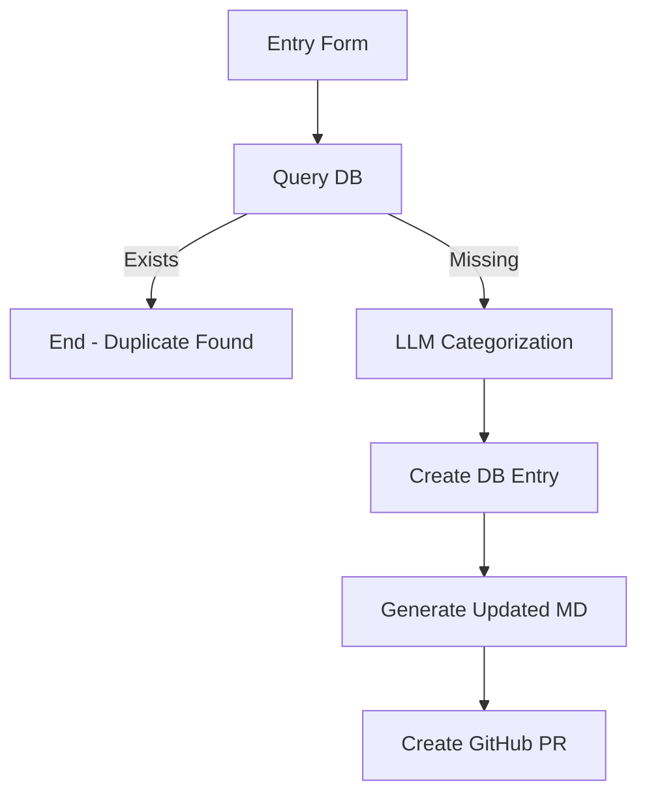

# New Entry Workflow

This workflow processes new vendor submissions through a web form, categorizes them using LLM, and creates GitHub pull requests for review and integration.

## Purpose

- Accept new vendor submissions via web form
- Check for duplicate entries
- Use LLM to categorize new entries
- Store entries in the database
- Generate updated markdown
- Create GitHub pull request for review

## Workflow Diagram



## Detailed Steps

### 1. Entry Form (Webhook Trigger)
- **Node**: Webhook
- **Method**: POST
- **Endpoint**: `/awesome/new-entry`
- **Expected Payload**:
  ```json
  {
    "vendor_name": "Example Vendor",
    "url": "https://example.com"
  }
  ```

### 2. Query Database for Duplicates
- **Node**: PostgreSQL/NocoDB
- **Purpose**: Check if vendor already exists
- **Query**:
  ```sql
  SELECT id, vendor_name, url, status
  FROM vendors
  WHERE LOWER(vendor_name) = LOWER($1)
  OR url = $2
  ```
- **Parameters**: `[vendor_name, url]`

### 3. Duplicate Check Logic
- **Node**: IF
- **Condition**: Check if query returned results
- **True Path**: End workflow with duplicate message
- **False Path**: Continue to categorization

### 4. LLM Categorization
- **Node**: OpenAI/LLM
- **Purpose**: Determine appropriate category and subcategory
- **Prompt**:
  ```
  Categorize this vendor for an Awesome List about live events, concert touring, theatre, and broadcast production:

  Vendor: {vendor_name}
  URL: {url}

  Available categories:
  - Audio (Mixing Consoles, Microphones & IEMs, Loudspeakers & Amplifiers, RF & Wireless, Interfaces/DSP & Control, Measurement & Analysis, Budget & Entry-Level)
  - Video (Cameras & Acquisition, Vision Mixers & Production, Playback & Media Servers, LED Processing & Display, Signal Conversion & Tools, Capture/Control & Utilities)
  - Lighting & Rigging (Lighting Control Consoles, Lighting Fixtures & Effects, Followspot & Tracking Systems, Rigging & Hoists, Trussing & Staging, Dimming & Power Control)
  - Networking & Control (Network Switches & Infrastructure, Protocols & Standards, Control Interfaces & Automation, Real-time Graphics & Visual Engines, KVM & IP Extension)
  - Infrastructure & Hardware (Connectors & Cabling, Fibre & Signal Transport, AV Routing & Processing, Racks & Enclosures)
  - Power & Distribution (Power Conditioning & Backup, Entertainment Power Distribution)
  - Software (Design & Visualisation, Show Control & Playback, Media & VJ Software)

  Return JSON: {"category": "Audio", "subcategory": "Mixing Consoles", "description": "Brief description"}
  ```

### 5. Create Database Entry
- **Node**: PostgreSQL/NocoDB
- **Operation**: INSERT
- **Table**: vendors
- **Data**:
  ```json
  {
    "vendor_name": "{vendor_name}",
    "url": "{url}",
    "description": "{llm_description}",
    "category": "{llm_category}",
    "subcategory": "{llm_subcategory}",
    "status": "pending_review",
    "date_added": "now()",
    "created_by": "form"
  }
  ```

### 6. Generate Updated Markdown
- **Node**: Function
- **Purpose**: Rebuild entire README from database
- **Process**:
  1. Query all active and pending entries from database
  2. Group by category and subcategory
  3. Generate markdown following existing format
  4. Preserve table of contents and structure

### 7. Create GitHub Pull Request
- **Node**: GitHub
- **Operation**: Create Pull Request
- **Repository**: `Capp3/awesome-production`
- **Title**: `Add {vendor_name} to {category} - {subcategory}`
- **Body**:
  ```markdown
  ## New Vendor Addition

  **Vendor**: {vendor_name}
  **URL**: {url}
  **Category**: {category} > {subcategory}
  **Description**: {description}

  This entry was automatically generated from form submission.

  ### Changes
  - Added new vendor entry to {subcategory} section
  - Updated markdown formatting

  ### Review Checklist
  - [ ] Verify vendor URL is accessible
  - [ ] Confirm appropriate category placement
  - [ ] Check description accuracy
  - [ ] Ensure no duplicate entries
  ```

## n8n Node Configuration

### Webhook Node
```json
{
  "httpMethod": "POST",
  "path": "awesome/new-entry",
  "responseMode": "responseNode",
  "options": {
    "noResponseBody": false
  }
}
```

### Function Node - Duplicate Check
```javascript
const vendorName = $input.first().json.vendor_name;
const url = $input.first().json.url;

// Check if any results were returned from database query
const existingEntries = $input.all();

if (existingEntries.length > 0) {
  return [{
    json: {
      duplicate: true,
      message: `Duplicate found: ${existingEntries[0].json.vendor_name} (${existingEntries[0].json.url})`,
      existing_entry: existingEntries[0].json
    }
  }];
} else {
  return [{
    json: {
      duplicate: false,
      vendor_name: vendorName,
      url: url
    }
  }];
}
```

### Function Node - Markdown Generation
```javascript
// Query all vendors from database (this would be a separate database query)
const vendors = $input.all();

// Group by category and subcategory
const grouped = {};
vendors.forEach(vendor => {
  const category = vendor.json.category;
  const subcategory = vendor.json.subcategory;

  if (!grouped[category]) {
    grouped[category] = {};
  }
  if (!grouped[category][subcategory]) {
    grouped[category][subcategory] = [];
  }

  grouped[category][subcategory].push(vendor.json);
});

// Generate markdown
let markdown = `# 🎚️ Awesome Production [](https://awesome.re)

A curated list of manufacturers, vendors, standards organisations, and useful resources for live events, concert touring, theatre, and broadcast.

---

## 📚 Table of Contents

`;

// Add table of contents and content generation logic here
// This is a simplified version - full implementation would include all categories

return [{
  json: {
    content: markdown,
    filename: "README.md"
  }
}];
```

### GitHub Node
```json
{
  "operation": "create",
  "owner": "Capp3",
  "repository": "awesome-production",
  "title": "Add {{ $json.vendor_name }} to {{ $json.category }} - {{ $json.subcategory }}",
  "body": "{{ $json.pr_body }}",
  "head": "feature/add-{{ $json.vendor_name }}",
  "base": "main"
}
```

## Form Interface

### HTML Form
```html
<!DOCTYPE html>
<html>
<head>
    <title>Add New Vendor - Awesome Production</title>
    <style>
        body { font-family: Arial, sans-serif; max-width: 600px; margin: 0 auto; padding: 20px; }
        .form-group { margin-bottom: 15px; }
        label { display: block; margin-bottom: 5px; font-weight: bold; }
        input[type="text"] { width: 100%; padding: 8px; border: 1px solid #ddd; border-radius: 4px; }
        button { background: #007cba; color: white; padding: 10px 20px; border: none; border-radius: 4px; cursor: pointer; }
        button:hover { background: #005a87; }
        .message { margin-top: 20px; padding: 10px; border-radius: 4px; }
        .success { background: #d4edda; color: #155724; border: 1px solid #c3e6cb; }
        .error { background: #f8d7da; color: #721c24; border: 1px solid #f5c6cb; }
    </style>
</head>
<body>
    <h1>Add New Vendor to Awesome Production</h1>
    <form id="vendorForm">
        <div class="form-group">
            <label for="vendor_name">Vendor Name:</label>
            <input type="text" id="vendor_name" name="vendor_name" required>
        </div>
        <div class="form-group">
            <label for="url">Website URL:</label>
            <input type="url" id="url" name="url" required>
        </div>
        <button type="submit">Submit Vendor</button>
    </form>
    <div id="message"></div>

    <script>
        document.getElementById('vendorForm').addEventListener('submit', async function(e) {
            e.preventDefault();

            const formData = {
                vendor_name: document.getElementById('vendor_name').value,
                url: document.getElementById('url').value
            };

            try {
                const response = await fetch('/webhook/awesome/new-entry', {
                    method: 'POST',
                    headers: {
                        'Content-Type': 'application/json',
                    },
                    body: JSON.stringify(formData)
                });

                const result = await response.json();

                if (result.success) {
                    document.getElementById('message').innerHTML =
                        '<div class="message success">Vendor submitted successfully! A pull request will be created for review.</div>';
                    document.getElementById('vendorForm').reset();
                } else {
                    document.getElementById('message').innerHTML =
                        '<div class="message error">Error: ' + result.message + '</div>';
                }
            } catch (error) {
                document.getElementById('message').innerHTML =
                    '<div class="message error">Error submitting vendor: ' + error.message + '</div>';
            }
        });
    </script>
</body>
</html>
```

## Error Handling

### Common Issues
1. **Duplicate Entries**: Return clear message with existing entry details
2. **Invalid URLs**: Validate URL format before processing
3. **LLM API Failures**: Fall back to manual categorization
4. **Database Errors**: Retry with exponential backoff
5. **GitHub API Failures**: Queue for retry or manual processing

### Error Responses
```json
{
  "success": false,
  "error": "duplicate",
  "message": "Vendor already exists: Allen & Heath (https://www.allen-heath.com/)",
  "existing_entry": {
    "id": 123,
    "vendor_name": "Allen & Heath",
    "url": "https://www.allen-heath.com/",
    "category": "Audio",
    "subcategory": "Mixing Consoles"
  }
}
```

## Validation

### Input Validation
- **Vendor Name**: Required, non-empty, reasonable length
- **URL**: Required, valid URL format, accessible
- **Rate Limiting**: Prevent spam submissions

### Business Logic Validation
- **Duplicate Check**: Name and URL uniqueness
- **Category Validation**: Ensure LLM output matches available categories
- **URL Accessibility**: Basic connectivity check

## Monitoring

### Success Metrics
- Form submissions per day
- Successful categorizations
- PR creation rate
- Processing time

### Alerts
- High duplicate rate
- LLM API failures
- GitHub API errors
- Database connection issues

## Security Considerations

- **Input Sanitization**: Clean all user inputs
- **Rate Limiting**: Prevent abuse
- **Authentication**: Consider form access control
- **Validation**: Server-side validation of all inputs

## Testing

### Unit Tests
- Form validation logic
- Duplicate detection
- Markdown generation
- Error handling

### Integration Tests
- End-to-end workflow
- Database operations
- GitHub API integration
- LLM categorization

## Dependencies

- n8n instance with webhook support
- PostgreSQL database
- LLM API access
- GitHub repository access
- Web server for form hosting

## Estimated Runtime

- **Typical submission**: 30-60 seconds
- **With LLM processing**: 1-2 minutes
- **With GitHub PR creation**: 2-3 minutes

*Times may vary based on LLM API response times and GitHub API performance.*
