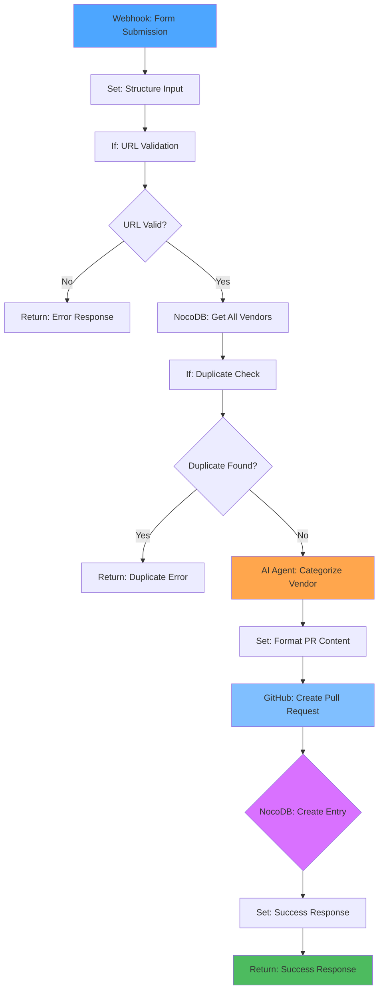

# New Entry Workflow

This workflow processes new vendor submissions through a web form, checks for duplicates, categorizes them using AI Agent node, and creates GitHub pull requests for review and integration.

## Purpose

- Accept new vendor submissions via web form (URL and company name)
- Validate input data and check for duplicate entries
- Use AI Agent node to categorize new entries (category and subcategory)
- Store entries in NocoDB database
- Create GitHub pull request with formatted vendor entry

## Workflow Diagram



## Detailed Node Flow

### Step 1: Receive Form Submission

- **Webhook Node**: Receives POST request with vendor data
- **Input**: `{ url: string, company_name: string }`
- **Output**: Raw form data

### Step 2: Structure Input Data

- **Set Node**: Clean and structure input data
- **Purpose**: Normalize data, add timestamps, prepare for validation
- **Output**: Structured data with validation fields

### Step 3: Validate URL Format

- **If Node**: Check URL format
- **Purpose**: Basic URL validation before processing
- **Output**: Continue if valid, error if invalid

### Step 4: Check for Duplicates

- **NocoDB Get All Node**: Fetch all existing vendors (Execute Once)
- **If Node**: Check if URL already exists
- **Purpose**: Prevent duplicate entries
- **Output**: Continue if new, error if duplicate

### Step 5: Categorize with AI

- **AI Agent Node**: Use LLM to determine category and subcategory
- **Purpose**: Automatically categorize vendor based on name and URL
- **Output**: Category, subcategory, and description

### Step 6: Format GitHub PR Content

- **Set Node**: Format vendor entry in markdown format
- **Purpose**: Prepare content for GitHub PR
- **Output**: Formatted markdown entry

### Step 7: Create GitHub Pull Request

- **GitHub Node**: Create PR with new vendor entry
- **Purpose**: Add vendor to awesome list via PR for review
- **Output**: PR creation confirmation

### Step 8: Store to Database

- **NocoDB Create Node**: Store submission record
- **Purpose**: Track all submissions
- **Output**: Database record confirmation

### Step 9: Return Response

- **Set Node**: Format success response
- **Return Node**: Send response to user
- **Output**: Success message with PR URL

## Detailed Node Configurations

### Node 1: Webhook - Form Submission

**Node Type**: Webhook (n8n-nodes-base.webhook)

**Configuration**:

```json
{
  "httpMethod": "POST",
  "path": "awesome/new-entry",
  "responseMode": "responseNode",
  "options": {
    "noResponseBody": false,
    "responseHeaders": {
      "Content-Type": "application/json"
    }
  }
}
```

**Settings**:

- **HTTP Method**: POST
- **Path**: `awesome/new-entry`
- **Response Mode**: "Using 'Respond to Webhook' Node"
- **Response Code**: 200
- **Options**:
  - Response Body: Enabled
  - Response Headers: Content-Type: application/json

**Expected Input**:

```json
{
  "url": "https://example.com",
  "company_name": "Example Vendor"
}
```

**Output**: Raw form data passed to next node

---

### Node 2: Set - Structure Input Data

**Node Type**: Set (n8n-nodes-base.set)

**Configuration**:

```json
{
  "assignments": {
    "assignments": [
      {
        "id": "vendor_name",
        "name": "vendor_name",
        "value": "={{ $json.company_name.trim() }}",
        "type": "string"
      },
      {
        "id": "url",
        "name": "url",
        "value": "={{ $json.url.trim().replace(/\\/$/, '') }}",
        "type": "string"
      },
      {
        "id": "submission_time",
        "name": "submission_time",
        "value": "={{ $now }}",
        "type": "dateTime"
      }
    ],
    "options": {
      "dotNotation": true
    }
  },
  "options": {}
}
```

**Settings**:

- **Mode**: Manual
- **Fields to Set**:
  - `vendor_name`: `={{ $json.company_name.trim() }}` (trim whitespace)
  - `url`: `={{ $json.url.trim().replace(/\\/$/, '') }}` (trim and remove trailing slash)
  - `submission_time`: `={{ $now }}` (current timestamp)

**Purpose**: Clean and normalize input data

**Output**: Structured data ready for validation

---

### Node 3: If - URL Validation

**Node Type**: If (n8n-nodes-base.if)

**Configuration**:

```json
{
  "conditions": {
    "options": {
      "caseSensitive": false,
      "leftValue": "",
      "typeValidation": "strict",
      "version": 2
    },
    "conditions": [
      {
        "id": "url_pattern",
        "leftValue": "={{ $json.url }}",
        "rightValue": "",
        "operator": {
          "type": "string",
          "operation": "regex",
          "name": "filter.operator.regex"
        }
      }
    ],
    "combinator": "and"
  },
  "options": {}
}
```

**Settings**:

- **Condition**: URL matches regex pattern
- **Left Value**: `={{ $json.url }}`
- **Right Value**: `^https?://[\\w\\-\\.]+(\\.[\\w\\-\\.]+)+([\\w\\-\\.,@?^=%&:/~\\+#]*[\\w\\-\\@?^=%&/~\\+#])?$`
- **Operator**: Regex
- **Options**:
  - Case Sensitive: No

**Purpose**: Validate URL format (must start with http:// or https://)

**True Path**: Continue to duplicate check
**False Path**: Return error response

**Alternative (If regex not available)**: Use Function node:

```javascript
const url = $input.first().json.url;
const urlPattern =
  /^https?:\/\/[\w\-\.]+(\.[\w\-\.]+)+([\w\-\.,@?^=%&:/~\+#]*[\w\-@?^=%&/~\+#])?$/;

return [
  {
    json: {
      ...$input.first().json,
      url_valid: urlPattern.test(url),
    },
  },
];
```

Then use second If node to check `url_valid === true`

---

### Node 4: NocoDB - Get All Vendors (Duplicate Check)

**Node Type**: NocoDB (n8n-nodes-base.nocoDb)

**Configuration**:

```json
{
  "authentication": "nocoDbApiToken",
  "operation": "getAll",
  "projectId": "pxtd3z9ygd9zprn",
  "table": "md5mzz6b4mvjs1p",
  "returnAll": true,
  "options": {}
}
```

**Settings**:

- **Authentication**: NocoDB API Token
- **Operation**: GetAll
- **Project ID**: `pxtd3z9ygd9zprn`
- **Table ID**: `md5mzz6b4mvjs1p`
- **Return All**: Yes
- **Execute Once**: ✅ **CRITICAL** - Enable this to fetch all records once and cache for the workflow execution
- **Options**: Default

**Purpose**: Get all existing vendors for duplicate checking

**Output**: Array of all existing vendor records

---

### Node 5: If - Duplicate Detection

**Node Type**: If (n8n-nodes-base.if)

**Configuration**:

```json
{
  "conditions": {
    "options": {
      "caseSensitive": false,
      "leftValue": "",
      "typeValidation": "strict",
      "version": 2
    },
    "conditions": [
      {
        "id": "duplicate_check",
        "leftValue": "={{ $json.url }}",
        "rightValue": "={{ $('Get All Vendors').item.json.url }}",
        "operator": {
          "type": "string",
          "operation": "equals",
          "name": "filter.operator.equals"
        }
      }
    ],
    "combinator": "and"
  },
  "options": {
    "ignoreCase": true
  }
}
```

**Settings**:

- **Condition**: Current URL equals any existing vendor URL
- **Left Value**: `={{ $json.url }}` (current submission)
- **Right Value**: `={{ $('Get All Vendors').item.json.url }}` (all existing URLs)
- **Operator**: Equals
- **Options**:
  - Case Sensitive: No
  - Ignore Case: Yes

**Purpose**: Check if URL already exists in database

**True Path**: Duplicate found → Return error
**False Path**: No duplicate → Continue to AI categorization

**Note**: If native If node doesn't support comparing against array, use Function node:

```javascript
const currentUrl = $input.first().json.url.toLowerCase();
const existingVendors = $("Get All Vendors").all();

const duplicate = existingVendors.some((vendor) => {
  const existingUrl = vendor.json.url?.toLowerCase();
  return existingUrl === currentUrl;
});

return [
  {
    json: {
      ...$input.first().json,
      is_duplicate: duplicate,
    },
  },
];
```

Then use second If node: `is_duplicate === true`

---

### Node 6: AI Agent - Categorize Vendor

**Node Type**: AI Agent (n8n-nodes-base.aiAgent)

**Configuration**:

```json
{
  "model": "gpt-4",
  "prompt": "Categorize this vendor for an awesome-production list about live events, concert touring, theatre, and broadcast production:\n\nCompany: {{ $json.vendor_name }}\nURL: {{ $json.url }}\n\nAvailable categories:\n- Audio (Mixing Consoles, Microphones & IEMs, Loudspeakers & Amplifiers, RF & Wireless, Interfaces/DSP & Control, Measurement & Analysis, Budget & Entry-Level)\n- Video (Cameras & Acquisition, Vision Mixers & Production, Playback & Media Servers, LED Processing & Display, Signal Conversion & Tools, Capture/Control & Utilities)\n- Lighting & Rigging (Lighting Control Consoles, Lighting Fixtures & Effects, Followspot & Tracking Systems, Rigging & Hoists, Trussing & Staging, Dimming & Power Control)\n- Networking & Control (Network Switches & Infrastructure, Protocols & Standards, Control Interfaces & Automation, Real-time Graphics & Visual Engines, KVM & IP Extension)\n- Infrastructure & Hardware (Connectors & Cabling, Fibre & Signal Transport, AV Routing & Processing, Racks & Enclosures)\n- Power & Distribution (Power Conditioning & Backup, Entertainment Power Distribution)\n- Software (Design & Visualisation, Show Control & Playback, Media & VJ Software)\n\nReturn JSON format only:\n{\n  \"category\": \"Category Name\",\n  \"subcategory\": \"Subcategory Name\",\n  \"description\": \"Brief description of what this vendor provides\"\n}",
  "options": {
    "temperature": 0.3,
    "maxTokens": 500
  }
}
```

**Settings**:

- **Model**: Use AI Agent node settings (supports multiple providers)
- **Prompt**:

  ```
  Categorize this vendor for an awesome-production list about live events, concert touring, theatre, and broadcast production:

  Company: {{ $json.vendor_name }}
  URL: {{ $json.url }}

  Available categories:
  - Audio (Mixing Consoles, Microphones & IEMs, Loudspeakers & Amplifiers, RF & Wireless, Interfaces/DSP & Control, Measurement & Analysis, Budget & Entry-Level)
  - Video (Cameras & Acquisition, Vision Mixers & Production, Playback & Media Servers, LED Processing & Display, Signal Conversion & Tools, Capture/Control & Utilities)
  - Lighting & Rigging (Lighting Control Consoles, Lighting Fixtures & Effects, Followspot & Tracking Systems, Rigging & Hoists, Trussing & Staging, Dimming & Power Control)
  - Networking & Control (Network Switches & Infrastructure, Protocols & Standards, Control Interfaces & Automation, Real-time Graphics & Visual Engines, KVM & IP Extension)
  - Infrastructure & Hardware (Connectors & Cabling, Fibre & Signal Transport, AV Routing & Processing, Racks & Enclosures)
  - Power & Distribution (Power Conditioning & Backup, Entertainment Power Distribution)
  - Software (Design & Visualisation, Show Control & Playback, Media & VJ Software)

  Return JSON format only:
  {
    "category": "Category Name",
    "subcategory": "Subcategory Name",
    "description": "Brief description of what this vendor provides"
  }
  ```

- **Temperature**: 0.3 (more consistent results)
- **Max Tokens**: 500
- **Response Format**: JSON (if supported by AI Agent node)

**Purpose**: Automatically categorize vendor and generate description

**Output**: Category, subcategory, and description in JSON format

**Error Handling**: If AI Agent returns non-JSON, add Parse JSON node or Function node to extract:

```javascript
const response =
  $input.first().json.output ||
  $input.first().json.response ||
  $input.first().json;
let parsed;

if (typeof response === "string") {
  // Try to extract JSON from string
  const jsonMatch = response.match(/\{[\s\S]*\}/);
  parsed = jsonMatch ? JSON.parse(jsonMatch[0]) : JSON.parse(response);
} else {
  parsed = response;
}

return [
  {
    json: {
      ...$("Structure Input").first().json,
      category: parsed.category || parsed.Category,
      subcategory: parsed.subcategory || parsed.Subcategory,
      description: parsed.description || parsed.Description || "",
    },
  },
];
```

---

### Node 7: Set - Format GitHub PR Content

**Node Type**: Set (n8n-nodes-base.set)

**Configuration**:

```json
{
  "assignments": {
    "assignments": [
      {
        "id": "vendor_name",
        "name": "vendor_name",
        "value": "={{ $json.vendor_name }}",
        "type": "string"
      },
      {
        "id": "url",
        "name": "url",
        "value": "={{ $json.url }}",
        "type": "string"
      },
      {
        "id": "category",
        "name": "category",
        "value": "={{ $json.category }}",
        "type": "string"
      },
      {
        "id": "subcategory",
        "name": "subcategory",
        "value": "={{ $json.subcategory }}",
        "type": "string"
      },
      {
        "id": "description",
        "name": "description",
        "value": "={{ $json.description }}",
        "type": "string"
      },
      {
        "id": "pr_title",
        "name": "pr_title",
        "value": "={{ 'Add ' + $json.vendor_name + ' to ' + $json.category + ' - ' + $json.subcategory }}",
        "type": "string"
      },
      {
        "id": "pr_body",
        "name": "pr_body",
        "value": "={{ '## New Vendor Addition\\n\\n**Vendor**: ' + $json.vendor_name + '\\n**URL**: ' + $json.url + '\\n**Category**: ' + $json.category + ' > ' + $json.subcategory + '\\n**Description**: ' + $json.description + '\\n\\nThis entry was automatically generated from form submission.\\n\\n### Review Checklist\\n- [ ] Verify vendor URL is accessible\\n- [ ] Confirm appropriate category placement\\n- [ ] Check description accuracy\\n- [ ] Ensure no duplicate entries' }}",
        "type": "string"
      },
      {
        "id": "markdown_entry",
        "name": "markdown_entry",
        "value": "={{ '* [' + $json.vendor_name + '](' + $json.url + ') – ' + $json.description }}",
        "type": "string"
      },
      {
        "id": "branch_name",
        "name": "branch_name",
        "value": "={{ 'add-' + $json.vendor_name.toLowerCase().replace(/[^a-z0-9]+/g, '-').replace(/^-|-$/g, '') }}",
        "type": "string"
      }
    ],
    "options": {
      "dotNotation": true
    }
  },
  "options": {}
}
```

**Settings**:

- **Mode**: Manual
- **Fields to Set**:
  - Keep existing fields: `vendor_name`, `url`, `category`, `subcategory`, `description`
  - `pr_title`: `Add {vendor_name} to {category} - {subcategory}`
  - `pr_body`: Formatted PR description with review checklist
  - `markdown_entry`: `* [Vendor Name](URL) – Description` (format for README)
  - `branch_name`: Sanitized vendor name for Git branch

**Purpose**: Format all data needed for GitHub PR

**Output**: Complete PR data ready for GitHub node

---

### Node 8: GitHub - Create Pull Request

**Node Type**: GitHub (n8n-nodes-base.github)

**Configuration**:

```json
{
  "resource": "pullRequest",
  "operation": "create",
  "owner": "Capp3",
  "repository": "awesome-production",
  "title": "={{ $json.pr_title }}",
  "body": "={{ $json.pr_body }}",
  "head": "={{ $json.branch_name }}",
  "base": "main",
  "additionalFields": {
    "draft": false
  }
}
```

**Settings**:

- **Resource**: Pull Request
- **Operation**: Create
- **Owner**: `Capp3`
- **Repository**: `awesome-production`
- **Title**: `={{ $json.pr_title }}`
- **Body**: `={{ $json.pr_body }}`
- **Head Branch**: `={{ $json.branch_name }}` (will need to be created first)
- **Base Branch**: `main`
- **Additional Fields**:
  - Draft: false (create ready for review)

**Purpose**: Create PR to add vendor to awesome list

**Output**: PR creation confirmation with PR number and URL

**Note**: GitHub node may require creating the branch and file first. Alternative flow:

**8a. GitHub - Create Branch**

```json
{
  "resource": "branch",
  "operation": "create",
  "owner": "Capp3",
  "repository": "awesome-production",
  "branch": "={{ $json.branch_name }}",
  "sourceBranch": "main"
}
```

**8b. GitHub - Get File (README.md)**

```json
{
  "resource": "file",
  "operation": "get",
  "owner": "Capp3",
  "repository": "awesome-production",
  "filePath": "readme.md",
  "branch": "main"
}
```

**8c. Function - Insert Vendor Entry**

```javascript
const readme = $input.first().json.data;
const entry = $("Format PR Content").first().json.markdown_entry;
const category = $("Format PR Content").first().json.category;
const subcategory = $("Format PR Content").first().json.subcategory;

// Find category section (### Category)
const categoryRegex = new RegExp(
  `(###\\s+${category.replace(
    /[.*+?^${}()|[\]\\]/g,
    "\\$&"
  )}[\\s\\S]*?)(?=###|$)`,
  "i"
);
const categoryMatch = readme.match(categoryRegex);

if (!categoryMatch) {
  throw new Error(`Category "${category}" not found in README`);
}

// Find subcategory section (#### Subcategory)
const subcategoryRegex = new RegExp(
  `(####\\s+${subcategory.replace(
    /[.*+?^${}()|[\]\\]/g,
    "\\$&"
  )}[\\s\\S]*?)(?=####|###|$)`,
  "i"
);
const subcategoryMatch = categoryMatch[1].match(subcategoryRegex);

if (!subcategoryMatch) {
  throw new Error(
    `Subcategory "${subcategory}" not found in category "${category}"`
  );
}

// Insert entry (alphabetically sorted)
const subcategorySection = subcategoryMatch[1];
const entries = subcategorySection.match(/^\* \[.*$/gm) || [];
entries.push(entry);
entries.sort();

const newSubcategorySection =
  subcategorySection.replace(/^\* \[.*$/gm, "").trim() +
  "\n\n" +
  entries.join("\n") +
  "\n";

const newCategorySection = categoryMatch[1].replace(
  subcategoryRegex,
  newSubcategorySection
);

const newReadme = readme.replace(categoryRegex, newCategorySection);

return [
  {
    json: {
      ...$input.first().json,
      content: newReadme,
      sha: $input.first().json.sha,
    },
  },
];
```

**8d. GitHub - Create or Update File**

```json
{
  "resource": "file",
  "operation": "createOrUpdate",
  "owner": "Capp3",
  "repository": "awesome-production",
  "filePath": "readme.md",
  "branch": "={{ $('Format PR Content').first().json.branch_name }}",
  "content": "={{ $json.content }}",
  "message": "={{ 'Add ' + $('Format PR Content').first().json.vendor_name + ' to ' + $('Format PR Content').first().json.category + ' - ' + $('Format PR Content').first().json.subcategory }}",
  "additionalFields": {
    "sha": "={{ $json.sha }}"
  }
}
```

**8e. GitHub - Create Pull Request** (as configured above)

---

### Node 9: NocoDB - Create Entry

**Node Type**: NocoDB (n8n-nodes-base.nocoDb)

**Configuration**:

```json
{
  "authentication": "nocoDbApiToken",
  "operation": "create",
  "projectId": "pxtd3z9ygd9zprn",
  "table": "md5mzz6b4mvjs1p",
  "fieldsUi": {
    "fieldValues": [
      {
        "fieldName": "vendor_name",
        "fieldValue": "={{ $('Structure Input').first().json.vendor_name }}"
      },
      {
        "fieldName": "url",
        "fieldValue": "={{ $('Structure Input').first().json.url }}"
      },
      {
        "fieldName": "description",
        "fieldValue": "={{ $json.description }}"
      },
      {
        "fieldName": "category",
        "fieldValue": "={{ $json.category }}"
      },
      {
        "fieldName": "subcategory",
        "fieldValue": "={{ $json.subcategory }}"
      },
      {
        "fieldName": "status",
        "fieldValue": "pending_review"
      },
      {
        "fieldName": "date_added",
        "fieldValue": "={{ $('Structure Input').first().json.submission_time }}"
      },
      {
        "fieldName": "creation_by",
        "fieldValue": "form"
      }
    ]
  }
}
```

**Settings**:

- **Authentication**: NocoDB API Token
- **Operation**: Create
- **Project ID**: `pxtd3z9ygd9zprn`
- **Table ID**: `md5mzz6b4mvjs1p`
- **Fields**:
  - `vendor_name`: From Structure Input node
  - `url`: From Structure Input node
  - `description`: From AI Agent response
  - `category`: From AI Agent response
  - `subcategory`: From AI Agent response
  - `status`: `pending_review` (PR created, awaiting merge)
  - `date_added`: Submission timestamp
  - `creation_by`: `form`

**Purpose**: Store submission record in database

**Output**: Database record confirmation

**Error Handling**: If this fails, the PR may still exist - consider error handling

---

### Node 10: Set - Success Response

**Node Type**: Set (n8n-nodes-base.set)

**Configuration**:

```json
{
  "assignments": {
    "assignments": [
      {
        "id": "success",
        "name": "success",
        "value": true,
        "type": "boolean"
      },
      {
        "id": "message",
        "name": "message",
        "value": "={{ 'Vendor submitted successfully. Pull Request #' + $('Create Pull Request').first().json.number + ' created: ' + $('Create Pull Request').first().json.html_url }}",
        "type": "string"
      },
      {
        "id": "pr_number",
        "name": "pr_number",
        "value": "={{ $('Create Pull Request').first().json.number }}",
        "type": "number"
      },
      {
        "id": "pr_url",
        "name": "pr_url",
        "value": "={{ $('Create Pull Request').first().json.html_url }}",
        "type": "string"
      }
    ],
    "options": {
      "dotNotation": true
    }
  },
  "options": {}
}
```

**Settings**:

- **Mode**: Manual
- **Fields**:
  - `success`: `true`
  - `message`: Success message with PR number and URL
  - `pr_number`: PR number from GitHub
  - `pr_url`: PR URL from GitHub

**Purpose**: Format success response

**Output**: Success response data

---

### Node 11: Respond to Webhook - Success Response

**Node Type**: Respond to Webhook (n8n-nodes-base.respondToWebhook)

**Configuration**:

```json
{
  "options": {
    "responseCode": 200,
    "responseHeaders": {
      "entries": [
        {
          "name": "Content-Type",
          "value": "application/json"
        }
      ]
    }
  },
  "responseBody": "={{ JSON.stringify({ success: $json.success, message: $json.message, pr_number: $json.pr_number, pr_url: $json.pr_url }) }}",
  "optionsResponseMode": "json"
}
```

**Settings**:

- **Response Code**: 200
- **Response Headers**: Content-Type: application/json
- **Response Body**: JSON stringified success response
- **Response Mode**: JSON

**Purpose**: Return success response to form submission

**Output**: HTTP 200 response with success data

---

## Error Handling Nodes

### Error Path 1: Invalid URL Format

**After Node 3 (URL Validation - False)**:

- **Set Node**: Format error response
  ```json
  {
    "success": false,
    "error": "invalid_url",
    "message": "Invalid URL format. Please provide a valid URL starting with http:// or https://"
  }
  ```
- **Respond to Webhook**: Return 400 with error

### Error Path 2: Duplicate Found

**After Node 5 (Duplicate Check - True)**:

- **Set Node**: Format duplicate error
  ```json
  {
    "success": false,
    "error": "duplicate",
    "message": "={{ 'Vendor already exists: ' + $('Get All Vendors').item.json.vendor_name + ' (' + $('Get All Vendors').item.json.url + ')' }}",
    "existing_entry": {
      "vendor_name": "={{ $('Get All Vendors').item.json.vendor_name }}",
      "url": "={{ $('Get All Vendors').item.json.url }}",
      "category": "={{ $('Get All Vendors').item.json.category }}"
    }
  }
  ```
- **Respond to Webhook**: Return 409 (Conflict) with error

### Error Path 3: AI Agent Failure

**After Node 6 (AI Agent)**:

- **Error Trigger Node**: Catch AI Agent errors
- **Set Node**: Format error response
  ```json
  {
    "success": false,
    "error": "categorization_failed",
    "message": "Failed to categorize vendor. Please try again or submit manually."
  }
  ```
- **Respond to Webhook**: Return 500 with error

### Error Path 4: GitHub PR Failure

**After Node 8 (GitHub PR)**:

- **Error Trigger Node**: Catch GitHub API errors
- **Set Node**: Format error response
  ```json
  {
    "success": false,
    "error": "pr_creation_failed",
    "message": "Failed to create pull request. Vendor data saved to database. Please create PR manually."
  }
  ```
- **NocoDB Create**: Still create database entry with status "failed"
- **Respond to Webhook**: Return 500 with error

---

## Form Interface

### HTML Form

A simple HTML form that submits to the webhook endpoint:

```html
<!DOCTYPE html>
<html>
  <head>
    <title>Add New Vendor - Awesome Production</title>
    <style>
      body {
        font-family: Arial, sans-serif;
        max-width: 600px;
        margin: 50px auto;
        padding: 20px;
      }
      .form-group {
        margin-bottom: 20px;
      }
      label {
        display: block;
        margin-bottom: 8px;
        font-weight: bold;
      }
      input[type="text"],
      input[type="url"] {
        width: 100%;
        padding: 10px;
        border: 1px solid #ddd;
        border-radius: 4px;
        box-sizing: border-box;
      }
      button {
        background: #007cba;
        color: white;
        padding: 12px 24px;
        border: none;
        border-radius: 4px;
        cursor: pointer;
        font-size: 16px;
      }
      button:hover {
        background: #005a87;
      }
      button:disabled {
        background: #ccc;
        cursor: not-allowed;
      }
      .message {
        margin-top: 20px;
        padding: 15px;
        border-radius: 4px;
      }
      .success {
        background: #d4edda;
        color: #155724;
        border: 1px solid #c3e6cb;
      }
      .error {
        background: #f8d7da;
        color: #721c24;
        border: 1px solid #f5c6cb;
      }
    </style>
  </head>
  <body>
    <h1>Add New Vendor to Awesome Production</h1>
    <form id="vendorForm">
      <div class="form-group">
        <label for="company_name">Company Name:</label>
        <input
          type="text"
          id="company_name"
          name="company_name"
          required
          placeholder="Example: Allen & Heath"
        />
      </div>
      <div class="form-group">
        <label for="url">Website URL:</label>
        <input
          type="url"
          id="url"
          name="url"
          required
          placeholder="https://example.com"
        />
      </div>
      <button type="submit" id="submitBtn">Submit Vendor</button>
    </form>
    <div id="message"></div>

    <script>
      document
        .getElementById("vendorForm")
        .addEventListener("submit", async function (e) {
          e.preventDefault();
          const submitBtn = document.getElementById("submitBtn");
          const messageDiv = document.getElementById("message");

          submitBtn.disabled = true;
          submitBtn.textContent = "Submitting...";
          messageDiv.innerHTML = "";

          const formData = {
            company_name: document.getElementById("company_name").value.trim(),
            url: document.getElementById("url").value.trim(),
          };

          try {
            // Replace with your n8n webhook URL
            const webhookUrl =
              "https://your-n8n-instance.com/webhook/awesome/new-entry";

            const response = await fetch(webhookUrl, {
              method: "POST",
              headers: {
                "Content-Type": "application/json",
              },
              body: JSON.stringify(formData),
            });

            const result = await response.json();

            if (result.success) {
              messageDiv.innerHTML = `<div class="message success">
                            <strong>Success!</strong><br>
                            ${result.message}<br>
                            <a href="${result.pr_url}" target="_blank">View Pull Request</a>
                        </div>`;
              document.getElementById("vendorForm").reset();
            } else {
              messageDiv.innerHTML = `<div class="message error">
                            <strong>Error:</strong> ${result.message}
                        </div>`;
            }
          } catch (error) {
            messageDiv.innerHTML = `<div class="message error">
                        <strong>Error:</strong> Failed to submit vendor: ${error.message}
                    </div>`;
          } finally {
            submitBtn.disabled = false;
            submitBtn.textContent = "Submit Vendor";
          }
        });
    </script>
  </body>
</html>
```

**Form Endpoint**: Update the `webhookUrl` in the JavaScript to match your n8n webhook URL.

---

## Dependencies

- **n8n instance** (version 1.114.4+)
- **NocoDB** configured with vendors table
- **GitHub API** access with repository write permissions
- **AI Agent node** configured (supports OpenAI, Anthropic, etc.)
- **Webhook support** enabled in n8n

## Estimated Runtime

- **Fast path** (duplicate found): 2-5 seconds
- **Full workflow** (success): 30-90 seconds
  - URL validation: <1s
  - Duplicate check: 2-5s
  - AI categorization: 10-30s
  - GitHub PR creation: 5-15s
  - NocoDB storage: 1-2s

_Times may vary based on AI Agent API response times and GitHub API performance._

## Testing Checklist

- [ ] Form submission with valid data
- [ ] Duplicate URL detection
- [ ] Invalid URL format rejection
- [ ] AI categorization accuracy
- [ ] GitHub PR creation
- [ ] NocoDB entry storage
- [ ] Error handling for each failure point
- [ ] Response formatting
