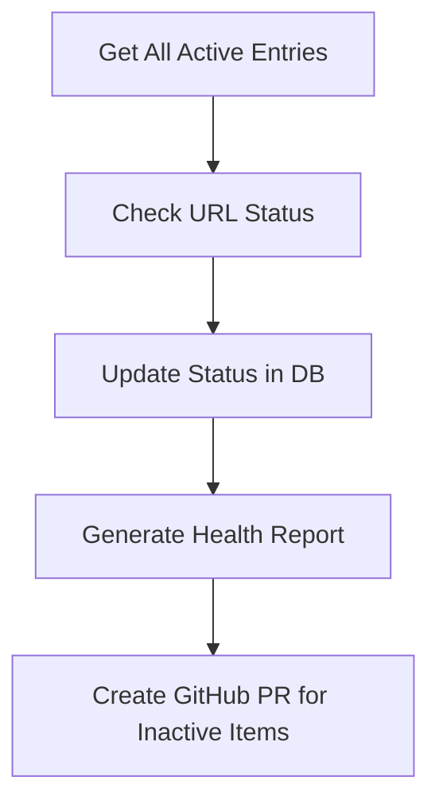

# Health Check Workflow

This workflow monitors the health of all vendor URLs in the database, identifies inactive or problematic links, and creates GitHub pull requests for review and cleanup.

## Purpose

- Check all active vendor URLs for accessibility
- Identify inactive, redirected, or problematic links
- Update database with current status
- Generate health reports
- Create pull requests for inactive items

## Workflow Diagram



## Detailed Steps

### 1. Get All Active Entries
- **Node**: PostgreSQL/NocoDB
- **Purpose**: Retrieve all active vendor entries
- **Query**:
  ```sql
  SELECT id, vendor_name, url, category, subcategory, last_checked
  FROM vendors
  WHERE status = 'active'
  ORDER BY last_checked ASC
  ```
- **Batch Size**: Process in batches of 50-100 URLs

### 2. Check URL Status
- **Node**: HTTP Request (in loop)
- **Purpose**: Test each URL for accessibility
- **Method**: HEAD (preferred) or GET
- **Timeout**: 10 seconds per request
- **Follow Redirects**: Yes (up to 3 redirects)
- **User Agent**: Set to identify the health check bot

### 3. Analyze Response
- **Node**: Function
- **Purpose**: Determine URL health status
- **Status Codes**:
  - **200, 301, 302**: Active
  - **404, 410**: Not Found (inactive)
  - **403, 401**: Access Denied (needs review)
  - **500, 502, 503**: Server Error (temporary)
  - **Timeout**: Unreachable
  - **Other**: Unknown (needs review)

### 4. Update Status in Database
- **Node**: PostgreSQL/NocoDB
- **Purpose**: Update vendor status and last checked timestamp
- **Operation**: UPDATE
- **Query**:
  ```sql
  UPDATE vendors
  SET status = $1,
      last_status_change = $2,
      last_checked = $3,
      health_notes = $4
  WHERE id = $5
  ```

### 5. Generate Health Report
- **Node**: Function
- **Purpose**: Create comprehensive health report
- **Report Contents**:
  - Total URLs checked
  - Active URLs count
  - Inactive URLs count
  - Newly inactive URLs
  - Previously inactive URLs still down
  - URLs that recovered
  - Error summary

### 6. Create GitHub Pull Request for Inactive Items
- **Node**: GitHub
- **Purpose**: Create PR to remove or mark inactive entries
- **Condition**: Only if inactive URLs found
- **Title**: `Health Check: Remove {count} inactive vendor URLs`
- **Body**: Detailed report with inactive entries

## n8n Node Configuration

### Schedule Trigger
```json
{
  "rule": {
    "interval": [
      {
        "field": "month",
        "value": 1
      }
    ]
  }
}
```

### HTTP Request Node - URL Check
```json
{
  "method": "HEAD",
  "url": "{{ $json.url }}",
  "options": {
    "timeout": 10000,
    "followRedirect": true,
    "maxRedirects": 3,
    "headers": {
      "User-Agent": "Awesome-Production-Health-Check/1.0"
    }
  }
}
```

### Function Node - Status Analysis
```javascript
const url = $input.first().json.url;
const response = $input.first().json;

let status = 'active';
let healthNotes = '';
let needsReview = false;

if (response.statusCode) {
  switch (response.statusCode) {
    case 200:
    case 301:
    case 302:
      status = 'active';
      healthNotes = `HTTP ${response.statusCode}`;
      break;

    case 404:
    case 410:
      status = 'inactive';
      healthNotes = `HTTP ${response.statusCode} - Not Found`;
      needsReview = true;
      break;

    case 403:
    case 401:
      status = 'pending_review';
      healthNotes = `HTTP ${response.statusCode} - Access Denied`;
      needsReview = true;
      break;

    case 500:
    case 502:
    case 503:
      status = 'pending_review';
      healthNotes = `HTTP ${response.statusCode} - Server Error`;
      needsReview = true;
      break;

    default:
      status = 'pending_review';
      healthNotes = `HTTP ${response.statusCode} - Unknown Status`;
      needsReview = true;
  }
} else {
  // Network error, timeout, etc.
  status = 'inactive';
  healthNotes = 'Network Error - Unreachable';
  needsReview = true;
}

return [{
  json: {
    ...$input.first().json,
    new_status: status,
    health_notes: healthNotes,
    needs_review: needsReview,
    checked_at: new Date().toISOString()
  }
}];
```

### Function Node - Health Report Generation
```javascript
const allResults = $input.all();
const totalChecked = allResults.length;
const activeCount = allResults.filter(r => r.json.new_status === 'active').length;
const inactiveCount = allResults.filter(r => r.json.new_status === 'inactive').length;
const reviewCount = allResults.filter(r => r.json.new_status === 'pending_review').length;

const newlyInactive = allResults.filter(r =>
  r.json.new_status === 'inactive' &&
  r.json.status === 'active'
);

const report = {
  summary: {
    total_checked: totalChecked,
    active: activeCount,
    inactive: inactiveCount,
    needs_review: reviewCount,
    newly_inactive: newlyInactive.length
  },
  newly_inactive: newlyInactive.map(item => ({
    vendor_name: item.json.vendor_name,
    url: item.json.url,
    category: item.json.category,
    subcategory: item.json.subcategory,
    health_notes: item.json.health_notes
  })),
  needs_review: allResults.filter(r => r.json.needs_review).map(item => ({
    vendor_name: item.json.vendor_name,
    url: item.json.url,
    category: item.json.category,
    subcategory: item.json.subcategory,
    health_notes: item.json.health_notes
  })),
  generated_at: new Date().toISOString()
};

return [{ json: report }];
```

### GitHub Node - Create PR
```json
{
  "operation": "create",
  "owner": "Capp3",
  "repository": "awesome-production",
  "title": "Health Check: Remove {{ $json.summary.newly_inactive }} inactive vendor URLs",
  "body": "## Health Check Report\n\n**Generated**: {{ $json.generated_at }}\n\n### Summary\n- Total URLs checked: {{ $json.summary.total_checked }}\n- Active: {{ $json.summary.active }}\n- Inactive: {{ $json.summary.inactive }}\n- Needs Review: {{ $json.summary.needs_review }}\n- Newly Inactive: {{ $json.summary.newly_inactive }}\n\n### Inactive URLs to Remove\n{{ #each $json.newly_inactive }}\n- **{{ vendor_name }}** ({{ category }} > {{ subcategory }})\n  - URL: {{ url }}\n  - Reason: {{ health_notes }}\n{{ /each }}\n\n### URLs Needing Review\n{{ #each $json.needs_review }}\n- **{{ vendor_name }}** ({{ category }} > {{ subcategory }})\n  - URL: {{ url }}\n  - Reason: {{ health_notes }}\n{{ /each }}",
  "head": "health-check/{{ $now.format('YYYY-MM-DD') }}",
  "base": "main"
}
```

## Health Check Logic

### URL Status Classification

#### Active Status
- **200 OK**: Page loads successfully
- **301/302 Redirects**: Permanent/temporary redirects (follow to final destination)
- **403 Forbidden**: May be intentional (some sites block automated requests)

#### Inactive Status
- **404 Not Found**: Page doesn't exist
- **410 Gone**: Page permanently removed
- **Timeout**: Server doesn't respond within timeout period
- **Connection Refused**: Server is down

#### Needs Review Status
- **500/502/503**: Server errors (may be temporary)
- **401 Unauthorized**: Authentication required
- **Unexpected redirects**: Redirects to unrelated domains
- **SSL errors**: Certificate issues

### Batch Processing

#### Batch Size
- **Small batches (10-20)**: For thorough checking
- **Medium batches (50-100)**: Balanced approach
- **Large batches (200+)**: For quick overview

#### Rate Limiting
- **Delay between requests**: 1-2 seconds
- **Respect robots.txt**: Check for crawl delays
- **User-Agent identification**: Identify as health check bot

## Error Handling

### Common Issues
1. **Network Timeouts**: Retry with exponential backoff
2. **Rate Limiting**: Implement delays between requests
3. **SSL Certificate Errors**: Log for manual review
4. **DNS Resolution Failures**: Mark as inactive
5. **Database Connection Issues**: Queue for retry

### Error Recovery
- **Retry Logic**: 3 attempts with increasing delays
- **Fallback Methods**: Try GET if HEAD fails
- **Partial Results**: Continue processing if some URLs fail
- **Error Logging**: Detailed logs for debugging

## Monitoring and Alerts

### Success Metrics
- **Check Completion Rate**: Percentage of URLs successfully checked
- **Processing Time**: Total time for health check cycle
- **Error Rate**: Percentage of failed checks
- **Inactive Discovery Rate**: New inactive URLs found

### Alert Conditions
- **High Error Rate**: > 20% of URLs fail to check
- **Many New Inactive**: > 10% of URLs become inactive
- **Processing Time**: Health check takes > 2 hours
- **Database Issues**: Connection or query failures

### Notification Methods
- **Email Alerts**: For critical issues
- **Slack/Discord**: For status updates
- **GitHub Issues**: For tracking problems
- **Dashboard**: Real-time status display

## Reporting

### Health Check Report Format
```markdown
# Health Check Report - {{ date }}

## Summary
- **Total URLs Checked**: 150
- **Active**: 142 (94.7%)
- **Inactive**: 5 (3.3%)
- **Needs Review**: 3 (2.0%)
- **Newly Inactive**: 2

## Inactive URLs
1. **Old Vendor** (Audio > Mixing Consoles)
   - URL: https://oldvendor.com
   - Status: 404 Not Found
   - Last Active: 2024-01-15

## URLs Needing Review
1. **Secure Vendor** (Video > Cameras)
   - URL: https://securevendor.com
   - Status: 403 Forbidden
   - Note: May require authentication

## Recommendations
- Remove 2 inactive URLs
- Review 3 URLs with access issues
- Consider updating 1 URL with permanent redirect
```

## Testing

### Test Scenarios
1. **Valid URLs**: Ensure active URLs are correctly identified
2. **Invalid URLs**: Test 404, 500, timeout scenarios
3. **Redirects**: Verify redirect following works correctly
4. **Rate Limiting**: Test behavior under rate limiting
5. **Error Handling**: Verify graceful failure handling

### Test Data
- **Sample URLs**: Mix of active, inactive, and problematic URLs
- **Mock Responses**: Simulate various HTTP status codes
- **Network Conditions**: Test timeout and connection scenarios

## Dependencies

- n8n instance with HTTP Request nodes
- PostgreSQL database with vendors table
- GitHub repository access
- Network connectivity for URL checking
- Monitoring/alerting system

## Estimated Runtime

- **100 URLs**: 5-10 minutes
- **500 URLs**: 25-50 minutes
- **1000+ URLs**: 1-2 hours

*Times depend on URL response times and rate limiting.*

## Maintenance

### Regular Tasks
- **Monthly Health Checks**: Automated via schedule
- **Quarterly Review**: Manual review of health check results
- **Annual Cleanup**: Remove long-term inactive entries
- **Performance Monitoring**: Track processing times and error rates

### Database Maintenance
- **Index Optimization**: Ensure efficient queries
- **Cleanup Old Data**: Archive historical health check data
- **Backup Verification**: Ensure data integrity
