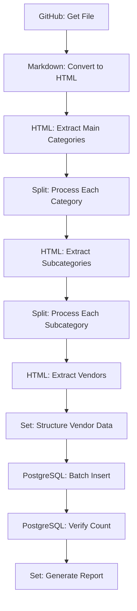

# Import Workflow Implementation Guide

## 🎯 Implementation Overview

This guide provides step-by-step instructions for implementing the Iterative Category-Based Processing import workflow in n8n 1.113.3.

## 📋 Prerequisites

- ✅ n8n 1.113.3 running and accessible
- ✅ PostgreSQL database with vendors table created
- ✅ GitHub API access configured
- ✅ Database connection configured in n8n

## 🔧 Node Configuration Details

### Node 1: GitHub - Get File

**Purpose**: Fetch the README.md from the awesome-production repository

**Configuration**:

```json
{
  "operation": "getFile",
  "repository": "Capp3/awesome-production",
  "filePath": "readme.md",
  "branch": "main"
}
```

**Expected Output**: Raw markdown content

### Node 2: Markdown - Convert to HTML

**Purpose**: Convert markdown content to HTML for parsing

**Configuration**:

```json
{
  "operation": "toHtml",
  "options": {
    "includeTableOfContents": false,
    "includeTitle": false
  }
}
```

**Expected Output**: HTML content ready for extraction

### Node 3: HTML - Extract Main Categories

**Purpose**: Extract all main categories (H3 headers)

**Configuration**:

```json
{
  "operation": "extractHtmlContent",
  "sourceData": "json",
  "jsonProperty": "content",
  "extractionValues": [
    {
      "key": "main_category",
      "cssSelector": "h3",
      "returnValue": "text",
      "returnArray": true
    }
  ],
  "options": {
    "trimValues": true,
    "cleanUpText": true
  }
}
```

**Expected Output**: Array of main category names

### Node 4: Split - Process Each Category

**Purpose**: Create separate items for each main category

**Configuration**:

- **Split In Batches**: `false`
- **Batch Size**: `1`
- **Options**: `{ "includeInputItem": false }`

**Expected Output**: Individual category processing items

### Node 5: HTML - Extract Subcategories (Per Category)

**Purpose**: Extract subcategories for the current main category

**Configuration**:

```json
{
  "operation": "extractHtmlContent",
  "sourceData": "json",
  "jsonProperty": "content",
  "extractionValues": [
    {
      "key": "subcategory",
      "cssSelector": "h4",
      "returnValue": "text",
      "returnArray": true
    }
  ],
  "options": {
    "trimValues": true,
    "cleanUpText": true
  }
}
```

**Expected Output**: Array of subcategory names for current category

### Node 6: Split - Process Each Subcategory

**Purpose**: Create separate items for each subcategory

**Configuration**:

- **Split In Batches**: `false`
- **Batch Size**: `1`
- **Options**: `{ "includeInputItem": false }`

**Expected Output**: Individual subcategory processing items

### Node 7: HTML - Extract Vendors (Per Subcategory)

**Purpose**: Extract vendor entries for the current subcategory

**Configuration**:

```json
{
  "operation": "extractHtmlContent",
  "sourceData": "json",
  "jsonProperty": "content",
  "extractionValues": [
    {
      "key": "vendor_name",
      "cssSelector": "ul li a",
      "returnValue": "text",
      "returnArray": true
    },
    {
      "key": "vendor_url",
      "cssSelector": "ul li a",
      "returnValue": "attribute",
      "attribute": "href",
      "returnArray": true
    },
    {
      "key": "vendor_description",
      "cssSelector": "ul li",
      "returnValue": "text",
      "returnArray": true
    }
  ],
  "options": {
    "trimValues": true,
    "cleanUpText": true
  }
}
```

**Expected Output**: Arrays of vendor data for current subcategory

### Node 8: Set - Structure Vendor Data

**Purpose**: Map extracted data to database schema

**Configuration**:

```json
{
  "assignments": {
    "vendor_name": "={{ $json.vendor_name.split('[')[1].split(']')[0] }}",
    "url": "={{ $json.vendor_url }}",
    "description": "={{ $json.vendor_description.split('– ')[1] || '' }}",
    "category": "={{ $('Split Category').item.json.main_category }}",
    "subcategory": "={{ $('Split Subcategory').item.json.subcategory }}",
    "status": "active",
    "date_added": "={{ new Date().toISOString() }}",
    "created_by": "import"
  }
}
```

**Expected Output**: Structured vendor records ready for database insertion

### Node 9: PostgreSQL - Batch Insert

**Purpose**: Insert vendor records into database

**Configuration**:

```json
{
  "operation": "insert",
  "table": "vendors",
  "columns": "vendor_name,url,description,category,subcategory,status,date_added,created_by",
  "options": {
    "mode": "batch",
    "batchSize": 50,
    "onConflict": "ignore"
  }
}
```

**Expected Output**: Database insertion results

### Node 10: PostgreSQL - Verify Count

**Purpose**: Confirm import success

**Configuration**:

```json
{
  "operation": "executeQuery",
  "query": "SELECT COUNT(*) as total FROM vendors WHERE created_by = 'import'"
}
```

**Expected Output**: Import statistics

### Node 11: Set - Generate Report

**Purpose**: Create import summary report

**Configuration**:

```json
{
  "assignments": {
    "import_status": "complete",
    "total_vendors": "={{ $('PostgreSQL Verify Count').item.json.total }}",
    "import_date": "={{ new Date().toISOString() }}",
    "categories_processed": "={{ $('Split Category').all().length }}",
    "subcategories_processed": "={{ $('Split Subcategory').all().length }}"
  }
}
```

**Expected Output**: Import summary report

## 🔄 Workflow Execution Flow



## 🧪 Testing Strategy

### 1. Individual Node Testing

- Test each node individually with sample data
- Verify output format matches expectations
- Check for proper error handling

### 2. Integration Testing

- Test complete workflow with small data subset
- Verify database insertion accuracy
- Check category association correctness

### 3. Full Import Testing

- Run complete workflow with actual repository data
- Verify all vendors are imported correctly
- Check for duplicate handling

## 🚨 Error Handling

### Common Issues and Solutions

1. **HTML Extraction Failures**

   - Verify CSS selectors match actual HTML structure
   - Check for changes in repository formatting
   - Test selectors with sample HTML

2. **Database Connection Issues**

   - Verify PostgreSQL credentials
   - Check database connection settings
   - Test database connectivity

3. **Data Structure Issues**

   - Validate input data format
   - Check Set node assignments
   - Verify data mapping logic

4. **Memory Issues with Large Datasets**
   - Use batch processing
   - Monitor n8n memory usage
   - Consider splitting into smaller workflows

## 📊 Monitoring and Logging

### Success Metrics

- Total vendors imported
- Categories processed
- Subcategories processed
- Processing time
- Error count

### Logging Points

- Workflow start/end
- Each category processing
- Database insertion results
- Error occurrences

## 🔧 Troubleshooting

### Debug Mode

- Enable debug mode in n8n
- Check node execution logs
- Verify data flow between nodes

### Data Validation

- Spot-check imported data
- Verify category associations
- Check URL accessibility

### Performance Optimization

- Monitor processing time
- Optimize batch sizes
- Consider parallel processing for large datasets

## 📝 Implementation Checklist

- [ ] Create database schema
- [ ] Configure n8n nodes
- [ ] Test individual nodes
- [ ] Test complete workflow
- [ ] Verify data accuracy
- [ ] Set up monitoring
- [ ] Document any customizations
- [ ] Create backup procedures

## 🎯 Expected Results

After successful implementation:

- All vendors from awesome-production repository imported
- Proper category and subcategory associations
- Database populated with structured vendor data
- Import statistics and reporting
- Ready for new entry and health check workflows

This implementation follows our focus principles:

- ✅ Purpose-built nodes only
- ✅ No code blocks
- ✅ Iterative processing for accuracy
- ✅ Future-proofing with adjustable document formatting
- ✅ Context7 validation ready
- ✅ Compatible with n8n 1.113.3 and NocoDB 0.264.9
